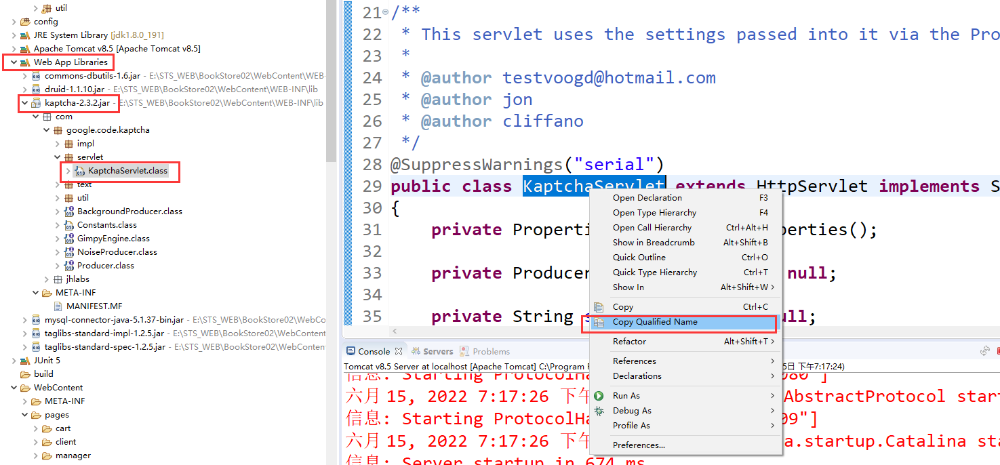

# day 01 创建servler

## 方式 一 day01_02

```xml
去xml注册
```

# 路径全部写绝对的

服务器解析的路径带项目名

客户端解析的路径不带项目名

servlet配置的路径在根目录下

jsp配置

```xml
<%-- <base href="<%=request.getContextPath() %>/"> --%>
<base href="<%=request.getScheme() %>://<%=request.getServerName() %>:<%=request.getServerPort()%><%=request.getContextPath() %>/">
<%@ taglib prefix="c" uri="http://java.sun.com/jsp/jstl/core" %>
<link type="text/css" rel="stylesheet" href="static/css/style.css" >
<script type="text/javascript" src="script/jquery-1.7.2.js"></script>
```


# day11_Cookie_Session

全部写在servlet中的doGet或doPost中

## 11.1 cookie

```java
//设置cookie
		Cookie cookie = new Cookie("stuAge", "18");
		//持久化，<0默认会话级别， =0 立即失效
		//cookie.setMaxAge(-1);
		//有效路径
		cookie.setPath(request.getContextPath()+"/a");
		response.addCookie(cookie);

//创建Cookie对象，并携带用户信息
		Cookie cookieName = new Cookie("stuName", "zhangsan");
		//响应给客户端
		response.addCookie(cookieName);

//获取Cookie
		Cookie[] cookies = request.getCookies();
		
		for (Cookie cookie : cookies) {
			System.out.print("cookieName:"+cookie.getName());
			System.out.println("cookieValue:"+cookie.getValue());
		}

//重新给cookie赋值
//1 覆盖式
//		Cookie cookieName = new Cookie("stuName", "lisi") ;
//		response.addCookie(cookieName);
//2 直接式
		Cookie[] cookies = request.getCookies();
		for (Cookie cookie : cookies) {
			if("stuName".equals(cookie.getName())) {
				cookie.setValue("wangwu");
				response.addCookie(cookie);
				break;
			}
            
protected void doGet(HttpServletRequest request, HttpServletResponse response) throws ServletException, IOException {
		String username = request.getParameter("username");
		String password = request.getParameter("password");
		String rp = request.getParameter("rp");
		if(rp != null) {
			//将数据存放Cookie中
			Cookie cookieName = new Cookie("username", username);
			Cookie cookiePwd = new Cookie("cookiePwd", password);
			//将Cookie持久化
			cookieName.setMaxAge(60);	//7天=60*60*24*7
			cookiePwd.setMaxAge(60);
			//将Cookie响应给浏览器
			response.addCookie(cookieName);
			response.addCookie(cookiePwd);
            
            //前端获取通过${cookie.username.value}
		}
		//跳转
	}
```

## Session钝化与活化

数据需要实现序列化接口Serializable

```java
* 钝化：将session对象及session对象中的数据，一同从内存中序列化到硬盘的过程称之为钝化。
  		* 时机：服务器关闭时触发
 * 活化：将session对象及session对象中的数据，一同从硬盘反序列化到内存的过程称之为活化。
  		* 时机：服务器重启时触发 
```


```java
package com.atguigu.demo;

import java.util.UUID;

public class Demo {

	/**
	 * * Cookie
	  		* 简介
	  			* Cookie实际上就是服务器保存在浏览器上的一段信息，主要用于区分不同的用户。
	  		* Cookie运行原理
	  			* 请求
	  			* 服务器创建一个Cookie对象，该Cookie对象携带用户信息，服务器发送（响应）给客户端
	  			* 以后客户端再发送请求时，会携带该Cookie对象。
	  			* 服务器会根据该Cookie对象（及信息），区分不同用户。  	
	  		* Cookie
	  			* 创建
	  				* Cookie cookie = new Cookie(String name,String value); 
	  				* response.addCookie(cookie);
	  			* 获取
	  				* Cookie[] cookies = request.getCookies(); 
	  				* cookie.getName()|getValue()
				* 修改
					* 覆盖式修改
						* Cookie cookie = new Cookie("同名","新值");
						* response.addCookie(cookie);
					* 直接修改
						* Cookie[] cookies = request.getCookies();	
						* 找到指定的Cookie
						* cookie.setValue("新值");
			* Cookie的键值问题
				* name不可以为中文，value可以为中文，需要指定字符集问题，所有建议使用英文。
	  		* Cookie有效性
	  			* 默认为会话级别，与浏览器有关（关闭浏览器或换一个浏览器失效）
	  			* 持久化
	  				* setMaxAge(ss:秒);
	  					* ss>0:在ss秒后失效
	  					* ss=0:立即失效
	  					* ss<0:默认会话级别
	  			* 注意：持久化Cookie，该Cookie不是会话级别。
	  		* Cookie有效路径
	  			* 默认有效路径：当前项目路径
	  			* setPath():一般设置有效路径，都是基于当前项目下的路径进行设置。
	  				* 如：cookie.setPath(request.getContextPath()+"/a");
	  		* Cookie应用
	  			* 记住密码
	  		* Cookie缺陷
	  			* Cookie的value为String型，不灵活。
	  			* Cookie存放在浏览器中，不安全。
	  			* Cookie过多，会浪费流量。
	   * Session
	   		* 简介
	   			* 类型：HttpSession
	   		* Session工作原理
	   			* 请求
	   			* 服务器创建Session,同时创建一个特殊的Cookie,该Cookie的key为固定值：JSESSIONID,
	   			   value为session的id。
	   			* 服务器将该Cookie对象发送（响应）给客户端
	   			* 以后客户端再请求时，会携带该Cookie对象。
	   			* 服务器会根据Cookie的value，找到相应的Session，从而区分不同的给用户。
	   		* Session获取  
	   			* html(Servlet):request.getSession()
	   			* jsp:直接获取（session是jsp中的隐含对象）
	  		* Session有效性
	  			* 默认有效性：当前会话（因为特殊的Cookie是会话级别）
	  			* 持久化Session
	  				* 持久化特殊Cookie 
	  				* Session存活时间
	  					* 默认存活时间为30分。
	  					* 设置session的非活动时间
	  						* web.xml中
	  						 	<session-config>
					        	   <session-timeout>30分钟</session-timeout>
					    		</session-config>
					    	* session.setMaxInactiveInterval(ss秒);
					    		* ss>0:在ss秒后失效
					    		* ss<=0:永不失效（Tomcat>=7）
					    	* session立即失效
					    		* session.invalidate();	 
	  		* Session钝化与活化
	  			* 钝化：将session对象及session对象中的数据，一同从内存中序列化到硬盘的过程称之为钝化。
	  				  * 时机：服务器关闭时触发
	  			* 活化：将session对象及session对象中的数据，一同从硬盘反序列化到内存的过程称之为活化。
	  				  * 时机：服务器重启时触发 
	  		* 表单重复提交问题
	  			* 转发,F5
	  			* 提交后，网速慢，连续点击提交按钮
	  			* 提交后，点击回退按钮，继续提交
	  				* 提交-Servlet-响应 	
	  				* 思路：在Servlet中干预提交，第一次提交，以后不提交
	  					1. 使用UUID，作为Token。将Token存放到session域和隐藏域中。
	  						* UUID:是一个全球唯一的32为的16进制的随机数。
	  					2. 提交，判断变量是否为初始值
	  					 	true:提交，移除session域中的Token(UUID)。
	  						false:不提交
	 */
	
	public static void main(String[] args) {
		
		String uuid = UUID.randomUUID().toString().replace("-","");
		
		System.out.println(uuid);
		
		
	}
	
}

```

## 11.2 验证码使用

导入jar包kaptcha-2.3.2.jar

* 先导包，再复制地址

* 
* 在web.xml中注册

```xml
  <!-- 注册谷歌的验证码KaptchaServlet  地址来源于上面操作-->
  <servlet>
  	<servlet-name>KaptchaServlet</servlet-name>
  	<servlet-class>com.google.code.kaptcha.servlet.KaptchaServlet</servlet-class>
  </servlet>
  
<!-- 设置访问方式 -->
  <servlet-mapping>
  	<servlet-name>KaptchaServlet</servlet-name>
  	<url-pattern>/code.jpg</url-pattern>
  </servlet-mapping>
```

* html配置

```jsp
<!--code.jpg 就是，前面导入了base.jsp里面设置了绝对路径所以下面不加/-->


<script type="text/javascript">
    
    	$(function(){
			//验证码
		$("img[src='code.jpg']").click(function(){
			//加随机数就是为了让值不一样
			$(this).attr("src","code.jpg?randmon="+Math.random());
		}); 
		
	});
</script>
```

* 代码使用

```java
		//获取验证码
		Object code2 = request.getSession().getAttribute("KAPTCHA_SESSION_KEY");
```


# day12 Filter过滤器

## 1 配置过滤器

创建filter类

url的/由服务器解析，在当前项目下

注册到web.xml 服务器会自动实例化，抽象类不能实例化

```java
/**
	 	* Filter：过滤器
	 		* 简介：程序的过滤器，过滤客户端与服务器之间的请求和响应。
	 			* 如:过滤字符集
	 			* Filter是web三大核心组件之一。
	 				* Servlet:处理用户请求
	 				* Filter:过滤用户请求&响应
	 				* Listener:监听器
	 			* web三大核心组件的共同点
	 				1. 实现某个接口
	 				2. 注册
	 		* HelloWorld
	 		* Filter生命周期
	 			* 构造器
	 				* 执行次数：执行一次
	 				* 执行时机 ：启动服务器时执行
	 			* init()
	 				* 执行次数：执行一次
	 				* 执行时机 ：启动服务器时执行
	 			* doFilter()
	 				* 执行次数：执行多次
	 				* 执行时机 ：每次过滤请求时执行
	 			* destroy()
	 			 	* 执行次数：执行一次
	 				* 执行时机 ：关闭服务器时执行
	 		* Filter的工作原理 	
	 			* 请求
	 			* 执行过滤器中的doFilter()，执行放行前的代码。
	 			* 放行请求，执行处理请求代码(Servlet)并做出响应。
	 			* 执行过滤器中的doFilter()，执行放行后的代码。
	 			* 响应
	 		* 多个Filter的执行流程
	 			* 请求
	 			* filter1放行前
	 			* filter2放行前
	 			* filter3放行前
	 			* 处理请求，做出响应
	 			* filter3放行后
	 			* filter2放行后
	 			* filter1放行后
	 			* 响应
	 		* 注意： filter的先后顺序，由web.xml中url的顺序决定。
	 		* Url的配置规则
	 			1. 精准配置：
	 				* <url-pattern>/UserServlet</url-pattern>
	 				* <servlet-name>UserServlet</servlet-name>
	 			2. 模糊配置：包含“*”的配置，称之为模糊配置。
	 				* 前置模糊:<url-pattern>*.jsp</url-pattern>
	 				* 后置模糊:<url-pattern>/pages/user/*</url-pattern>
	 				* 中间模糊（没有）
	 		* HttpFilter
	 			* HttpServlet : GenericServlet : Servlet
	 			* HttpFilter
	 				* getXXX()
	 				* abstract doFilter() 
	 				* overload doFilter()
	 	* 生活中的过滤器
	 		* 自来水过滤器
	 		* 空气 净化器
	 	* Listener:监听器
	 		* 生活中：狗崽队监听明星
	 			* 监听对象：明星
	 			* 监听事件：坏事
	 			* 监听结果：头条见
	 			* 监听者：狗崽队
	 		* 程序中：
	 			* 监听对象：ServletContext、HttpSession、ServletRequest等
	 			* 监听事件：对象创建、修改、删除等
	 			* 监听结果：需求
	 			* 监听者：程序员自己创建
	 */
```

## 2 用过滤器来验证是否登录

* HttpFilter 类

```java
package com.atguigu.filter;

import java.io.IOException;

import javax.servlet.Filter;
import javax.servlet.FilterChain;
import javax.servlet.FilterConfig;
import javax.servlet.ServletException;
import javax.servlet.ServletRequest;
import javax.servlet.ServletResponse;
import javax.servlet.http.HttpServletRequest;
import javax.servlet.http.HttpServletResponse;

/**
 * Servlet Filter implementation class HttpFilter
 */
public abstract class HttpFilter implements Filter {

	private FilterConfig filterConfig;
	
    public HttpFilter() {
        // TODO Auto-generated constructor stub
    }

	public void destroy() {
		// TODO Auto-generated method stub
	}

	public void doFilter(ServletRequest request, ServletResponse response, FilterChain chain) throws IOException, ServletException {
		HttpServletRequest req = (HttpServletRequest)request;
		HttpServletResponse res = (HttpServletResponse)response;
		doFilter(req, res, chain);
	}
	
	public abstract void doFilter(HttpServletRequest request, HttpServletResponse response, FilterChain chain) throws IOException, ServletException;

	public void init(FilterConfig fConfig) throws ServletException {
		this.filterConfig = fConfig;
	}

	/**
	 * 获取FilterConfig对象
	 * @return
	 */
	public FilterConfig getFilterConfig() {
		return filterConfig;
	}

	
	
}

```

过滤是登录

```java
//这是继承了自己写的HttpFilter类


	@Override
	public void doFilter(HttpServletRequest request, HttpServletResponse response, FilterChain chain)
			throws IOException, ServletException {
		//判断是否登录，登录：放行。未登录，跳转login.jsp
		HttpSession session = request.getSession();
		User user = (User)session.getAttribute("user");
		if(user == null) {
			//未登录，跳转login.jsp
			request.setAttribute("msg", "亲，该操作需要先登录哦！");
			request.getRequestDispatcher("/pages/user/login.jsp").forward(request, response);
		}else {
			//登录：放行。
			chain.doFilter(request, response);
		}
		
	}
		
```

web.xml

```xml
  <filter>
    <display-name>CheckLoginFilter</display-name>
    <filter-name>CheckLoginFilter</filter-name>
    <filter-class>com.atguigu.filter.CheckLoginFilter</filter-class>
  </filter>
  <filter-mapping>
    <filter-name>CheckLoginFilter</filter-name>
    <url-pattern>/OrderServlet</url-pattern> <!-- 过滤的servlet-->
  </filter-mapping>
```

# day14

## 1 批处理

```java
/**
	 * 通用的批处理增删改操作
	 * 
	 * @param sql
	 * 		insert 
	 * 		delete
	 * 		update
	 * @param params:二维数组
	 * 		一维：次数 多少行
	 * 		二维：参数 每一行都是一条记录
	 Object[][] orderItemParams = new Object[cartItems.size()][];
	 数据类型
	 orderItemParams[i] = new Object[] {count,
					cartItem.getAmount(), book.getTitle(), book.getAuthor(),
					book.getPrice(), book.getImgPath(), orderId};
	 * 		
	 * @return
	 */
	public void batchUpdate(String sql, Object[][] params) {
		// 获取连接
		Connection connection = JDBCUtils.getConnection();
		try {
			queryRunner.batch(connection, sql, params);
		} catch (SQLException e) {
//			e.printStackTrace();
			throw new RuntimeException(e);
		} finally {
//			JDBCUtils.releaseConnection(connection);
		}
	}

```
调用批处理


```java
package com.atguigu.service.impl;

import java.util.Date;
import java.util.List;

import com.atguigu.bean.Book;
import com.atguigu.bean.Cart;
import com.atguigu.bean.CartItem;
import com.atguigu.bean.Order;
import com.atguigu.bean.OrderItem;
import com.atguigu.bean.User;
import com.atguigu.dao.BookDao;
import com.atguigu.dao.OrderDao;
import com.atguigu.dao.OrderItemDao;
import com.atguigu.dao.impl.BookDaoImpl;
import com.atguigu.dao.impl.OrderDaoImpl;
import com.atguigu.dao.impl.OrderItemDaoImpl;
import com.atguigu.service.OrderService;
import com.atguigu.util.JDBCUtils;

public class OrderServiceImpl implements OrderService {

	private OrderDao orderDao = new OrderDaoImpl();
	private OrderItemDao orderItemDao = new OrderItemDaoImpl();
	private BookDao bookDao = new BookDaoImpl();
	/**
	 * * 去结账createOrder
	 * 		1. 生成订单
	 * 		2. 生成订单详情
	 * 		3. 更改相应book的库存和销量
	 * 		4. 清空购物车
	 * 
	 * * 批处理优化结账
	 * 		 * 1. BaseDao:添加batchUpdate()
	 * 			* queryRunner.batch(connection, sql, params);
	 * 			* params:Object[][]
	 * 			* 一维：次数
	 * 			* 二维：参数
			 * 2. OrderItemDao添加批处理接口
			 * 3. BookDao添加批处理接口
			 * 4. OrderServiceImpl调用dao批处理接口
			 * 		* Object[][] orderItemParams = new Object[cartItems.size()][];
					  Object[][] bookParams = new Object[cartItems.size()][];
					* orderItemParams[i] = new Object[]{参数的顺序};
	    * 使用事务优化结账
		 	* 开启事务：connection.setAutoCommit(false);|commit() rollback()
		 		1. 共用同一个connetion
		 			* ThreadLocal管理Connection
		 			* 删除BaseDao中的JDBCUtils.releaseConnection(connection);
		 		2. 统一处理异常（Filter）
		 			* 抛出BaseDao和BaseServlet中的异常，统一在Filter中处理
		 			* 统一开启事务，提交|回滚事务。
		
	 */
	@Override
	public String createOrder(Cart cart, User user) {
		//1. 生成订单
		//orderId=时间戳+userid
		String orderId = System.currentTimeMillis()+""+user.getId();		//null.
		orderDao.insertOrder(new Order(orderId, new Date(), cart.getTotalCount(),
				cart.getTotalAmount(), 0, user.getId()));
		
		//获取所有购物项
		List<CartItem> cartItems = cart.getCartItems();
		//OrderItem的二维参数
		Object[][] orderItemParams = new Object[cartItems.size()][];
		Object[][] bookParams = new Object[cartItems.size()][];
		
		//遍历购物项，添加到订单详情
		for (int i=0;i<cartItems.size();i++) {
			//2. 生成订单详情
			CartItem cartItem = cartItems.get(i);
			Book book = cartItem.getBook();
			int count = cartItem.getCount();
//			orderItemDao.insertOrderItem(new OrderItem(null, count,
//					cartItem.getAmount(), book.getTitle(), book.getAuthor(),
//					book.getPrice(), book.getImgPath(), orderId));
			//orderItemParams第二维赋值
			//`count`,amount,title,author,price,img_path,order_id
			orderItemParams[i] = new Object[] {count,
					cartItem.getAmount(), book.getTitle(), book.getAuthor(),
					book.getPrice(), book.getImgPath(), orderId};
			//3. 更改相应book的库存和销量
			int stock = book.getStock()-count;	//计算最终的库存
			int sales = book.getSales()+count;  //计算最终的销量
			//sales=?,stock=? where id=?
			bookParams[i] = new Object[] {sales,stock,book.getId()};
//			bookDao.updateBook(stock, sales, book.getId());
		}
		
		orderItemDao.insertOrderItem(orderItemParams);
		bookDao.updateBook(bookParams);
		
		//4. 清空购物车
		cart.emptyCart();
		return orderId;
	}

}

```

## 2 事物管理

JDBCUtils.java类获取 连接的

```java
package com.atguigu.util;

import java.sql.Connection;
import java.sql.SQLException;
import java.util.Properties;

import javax.sql.DataSource;

import com.alibaba.druid.pool.DruidDataSourceFactory;
/**
 * 获取连接和释放连接的工具类
 * @author Chunsheng Zhang
 *
 */
public class JDBCUtils {
	private static DataSource dataSource;
	
	/**
	 * ThreadLocal
	 * 		get()
	 * 		set()
	 *      remove()
	 */
	private static ThreadLocal<Connection> threadLocal = new ThreadLocal<>();
	
	static {
		try {
			//1、读取druip.properties文件
			Properties pro = new Properties();
			pro.load(JDBCUtils.class.getClassLoader().getResourceAsStream("druid.properties"));
			
			//2、连接连接池
			dataSource = DruidDataSourceFactory.createDataSource(pro);
		} catch (Exception e) {
			e.printStackTrace();
		}
	}

	//获取连接
	public static Connection getConnection() {
		Connection connection = threadLocal.get();
		try {
			if(connection == null) {
				connection = dataSource.getConnection();
				threadLocal.set(connection);
			}
		} catch (SQLException e) {
			e.printStackTrace();
		}
		return connection;
	}
//	public static Connection getConnection() {
//		Connection connection = null;
//		try {
//			connection = dataSource.getConnection();
//		} catch (SQLException e) {
//			e.printStackTrace();
//		}
//		return connection;
//	}

	//释放连接
	public static void releaseConnection() {
		Connection connection = threadLocal.get();
		if(connection != null) {
			try {
				connection.close();
				threadLocal.remove();
			} catch (SQLException e) {
				e.printStackTrace();
			}
		}
	}
//	public static void releaseConnection(Connection connection) {
//		if(connection != null) {
//			try {
//				connection.close();
//			} catch (SQLException e) {
//				e.printStackTrace();
//			}
//		}
//	}
}

```

filete.java

配置为/*全部

```java
	/**
	 * 1. 处理异常
	 * 2. 统一处理事务
	 */
	@Override
	public void doFilter(HttpServletRequest request, HttpServletResponse response, FilterChain chain)
			throws IOException, ServletException {
		Connection connection = JDBCUtils.getConnection(); // 获取connection，设置它不自动提交，关闭BaseDao的释放con代码
		try {
			//开启事务
			connection.setAutoCommit(false);
			//放行
			chain.doFilter(request, response);
			//无异常，提交事务
			connection.commit();
		} catch (Exception e) {
			//有异常，回滚事务
			try {
				connection.rollback();
			} catch (SQLException e1) {
				e1.printStackTrace();
			}
			e.printStackTrace();
			response.sendRedirect(request.getContextPath()+"/pages/error/transaction_error.jsp");
		}finally {
			//释放Connection
			JDBCUtils.releaseConnection();
		}
		
	}
```

## 3 ajax

### 3.1 js代码

```js
<script type="text/javascript">
	$(function(){
			
			$("#btn").click(function(){
				
					$.post("AjaxDemo","name=John&location=Boston",function(){
						 alert( "Data Saved: " );
					});
// 					$.ajax({
// 					   type: "POST",
// 					   url: "AjaxDemo",
// 					   data: "name=John&location=Boston",
// 					   success: function(msg){
// 					     alert( "Data Saved: " + msg );
// 					   }
// 					});
			});
			
			$("#btnGet").click(function(){
				//var json = {key:value,key2:value2,key3:value3}
				$.getJSON("AjaxDemo",{"name":"zhangsan","age":18},function(msg){
					alert("msg:"+msg.name);
				});
				
// 				$.get("AjaxDemo",{"name":"zhangsan","age":18},function(msg){
// 					alert("msg:"+msg.name);
// 				},"json");
				
// 				$.ajax({
// 					type:"get",
// 					url:"AjaxDemo",
// 					data:{"name":"zhangsan","age":18},
// 					dataType:"json",
// 					success:function(msg){
// 						alert("msg:"+msg.name);
// 					},
// 					error:function(){
// 						alert("error!!!");
// 					}
// 				});
				
			});
			
	});
</script>
```

### 3.2 java代码

```java
package com.atguigu.demo;

import java.io.IOException;
import java.io.PrintWriter;

import javax.servlet.ServletException;
import javax.servlet.http.HttpServlet;
import javax.servlet.http.HttpServletRequest;
import javax.servlet.http.HttpServletResponse;

/**
 * Servlet implementation class AjaxDemo
 */
public class AjaxDemo extends HttpServlet {
	private static final long serialVersionUID = 1L;
       
	protected void doGet(HttpServletRequest request, HttpServletResponse response) throws ServletException, IOException {
		System.out.println("doGet");
		String name = request.getParameter("name");
		String age = request.getParameter("age");
		System.out.println(name);
		System.out.println(age);
		
		PrintWriter writer = response.getWriter();
		writer.write("{\"name\":\"zhangsan\",\"age\":18}");
	}

	protected void doPost(HttpServletRequest request, HttpServletResponse response) throws ServletException, IOException {
		System.out.println("doPost");
		String name = request.getParameter("name");
		String location = request.getParameter("location");
		System.out.println(name);
		System.out.println(location);
		
	}

}

```


## 4 json转换

导入jar包Gson

```java
package com.test;

import java.util.ArrayList;
import java.util.HashMap;
import java.util.List;
import java.util.Map;

import com.google.gson.Gson;
import com.google.gson.reflect.TypeToken;

public class TestGson {
	public static void main(String[] args) {
		Gson g = new Gson();
		
		// 测试对象Student
		Student s = new Student("张三", 20);
		//转换为json
		String json = g.toJson(s);
		//结果{"name":"张三","age":20}
		System.out.println(json);
		//json 转换为对象
		Student student = g.fromJson(json, Student.class);
		//Student [name=张三, age=20]
		System.out.println(student);
		
		//ListArray转换
		List<Student> list = new ArrayList<Student>();
		list.add(new Student("张三",20));
		list.add(new Student("李四",21));
		//转换
		String listJson = g.toJson(list);
		//[{"name":"张三","age":20},{"name":"李四","age":21}] json数组
		System.out.println(listJson);
		List<Student> fromJson = g.fromJson(listJson,new TypeToken<List<Student>>() {}.getType());
		System.out.println(fromJson);
		
		//map
		Map<String,Student> map = new HashMap<String, Student>();
		map.put("zs", new Student("张三",12));
		map.put("ls", new Student("李四",12));
		String mapjson = g.toJson(map);
		//{"ls":{"name":"李四","age":12},"zs":{"name":"张三","age":12}}
		System.out.println(mapjson);
		//类似list
		Map<String,Student> mapfromJson = g.fromJson(mapjson, new TypeToken<Map<String,Student>>() {}.getType());
		//{ls=Student [name=李四, age=12], zs=Student [name=张三, age=12]}
		System.out.println(mapfromJson);
		
	}
}
class Student {
	private String name;
	private Integer age;
	@Override
	public String toString() {
		return "Student [name=" + name + ", age=" + age + "]";
	}
	public String getName() {
		return name;
	}
	public void setName(String name) {
		this.name = name;
	}
	public Integer getAge() {
		return age;
	}
	public void setAge(Integer age) {
		this.age = age;
	}
	public Student(String name, Integer age) {
		super();
		this.name = name;
		this.age = age;
	}
	
}
```

# day15文件上传下载

## 1 文件上传

```html
	<h1>文件上传</h1>
	<form action="FileUploadDemo" method="post" enctype="multipart/form-data">
		姓名：<input type="text" name="uname"><br>
		上传文件：<input type="file" name="fileupload"><br>
		<input type="submit" value="上传朋友圈">
	</form>
```

导入两个jar包，commons.fileupload、commons.io

```java


package com.atguigu.demo;

import java.io.File;
import java.io.IOException;
import java.io.PrintWriter;
import java.util.List;
import java.util.UUID;

import javax.servlet.ServletException;
import javax.servlet.http.HttpServlet;
import javax.servlet.http.HttpServletRequest;
import javax.servlet.http.HttpServletResponse;

import org.apache.commons.fileupload.FileItem;
import org.apache.commons.fileupload.FileUploadBase.FileSizeLimitExceededException;
import org.apache.commons.fileupload.disk.DiskFileItemFactory;
import org.apache.commons.fileupload.servlet.ServletFileUpload;

/**
 * Servlet implementation class FileUploadDemo
 */
public class FileUploadDemo extends HttpServlet {
	private static final long serialVersionUID = 1L;
       
	protected void doGet(HttpServletRequest request, HttpServletResponse response) throws ServletException, IOException {
		response.setContentType("text/html;charset=UTF-8");
		request.setCharacterEncoding("UTF-8");
		PrintWriter writer = response.getWriter();
		
		/*
		  	* 准备： 导入两个jar文件&页面3处
		  		1. 创建工厂类
		  		2. 创建解析器ServletFileUpload//ServletFileUpload 
		  		3. 使用ServletFileUpload中的List<FileItem> parseRequest(request)
		  		4. 使用FileItem中的write()方法，写到服务器。
		 */
		//1. 创建工厂类
		DiskFileItemFactory factory = new DiskFileItemFactory();
		//2. 创建解析器ServletFileUpload//ServletFileUpload 
		ServletFileUpload upload = new ServletFileUpload(factory);
		//获取upload的真实路径
		String realPath = this.getServletContext().getRealPath("/upload");
//		System.out.println("realPath:"+realPath);
		//设置单个文件的上传大小，单位B
		upload.setFileSizeMax(2*1024);
		//3. 使用ServletFileUpload中的List<FileItem> parseRequest(request)
		try {
			List<FileItem> list = upload.parseRequest(request);
			//迭代集合，找到指定的文件
			for (FileItem fileItem : list) {
				if(fileItem.isFormField() == false) {
					String uuid = UUID.randomUUID().toString().replace("-", "");
					String filePath = realPath+"/"+uuid+fileItem.getName();
					File file = new File(filePath);
					//4. 使用FileItem中的write()方法，写到服务器。
					fileItem.write(file);
				}
			}
			
		} catch (FileSizeLimitExceededException e) {
			writer.write("单个文件大小不能超过2k");
			e.printStackTrace();
		}catch (Exception e) {
			// TODO Auto-generated catch block
			e.printStackTrace();
		}
		
//		response.getWriter().write("upload success!");
		//获取参数
//		String username = request.getParameter("uname");
//		String fileupload = request.getParameter("fileupload");
//		System.out.println(username);
//		System.out.println(fileupload);
		
		
	}

	protected void doPost(HttpServletRequest request, HttpServletResponse response) throws ServletException, IOException {
		doGet(request, response);
	}

}

```

## 2 文件下载

```html
<h1>0401宝库</h1>
	<a href="${pageContext.request.contextPath }/FileDownLoadDemo?fileName=game.pptx">game.pptx</a>
	<a href="${pageContext.request.contextPath }/FileDownLoadDemo?fileName=魔兽世界.mp4">魔兽世界.mp4</a>
	<a href="${pageContext.request.contextPath }/FileDownLoadDemo?fileName=dwhd.txt">dwhd.txt</a>
	<a href="${pageContext.request.contextPath }/FileDownLoadDemo?fileName=a.mp4">a.mp4</a>
```

```java
package com.atguigu.demo;

import java.io.FileInputStream;
import java.io.IOException;
import java.net.URLEncoder;

import javax.servlet.ServletException;
import javax.servlet.ServletOutputStream;
import javax.servlet.http.HttpServlet;
import javax.servlet.http.HttpServletRequest;
import javax.servlet.http.HttpServletResponse;

import sun.misc.BASE64Encoder;

/**
 * Servlet implementation class FileDownLoadDemo
 */
public class FileDownLoadDemo extends HttpServlet {
	private static final long serialVersionUID = 1L;
       
	protected void doGet(HttpServletRequest request, HttpServletResponse response) throws ServletException, IOException {
		request.setCharacterEncoding("UTF-8");
//		response.setContentType("text/html;charset=UTF-8");
		
		//获取文件名
		String fileName = request.getParameter("fileName");
		//通过fileName获取该文件的真实路径
		String realPath = this.getServletContext().getRealPath("/WEB-INF/download");
		String downloadPath = realPath+"/"+fileName;
		System.out.println(downloadPath);
		
		//设置浏览器响应体文件类型
		String mimeType = request.getServletContext().getMimeType(fileName);
		response.setContentType(mimeType);
		//解决文件名中文乱码问题
		String header = request.getHeader("User-Agent");
		if(header != null && header.contains("Firefox")) {
			fileName = "=?utf-8?B?"+new BASE64Encoder().encode(fileName.getBytes("utf-8"))+"?=";
		}else {
			fileName = URLEncoder.encode(fileName, "UTF-8");
		}
		//设置浏览器响应体内容格式，为附件格式。(告诉浏览器别播放，下载)
		response.setHeader("Content-Disposition", "attachment; filename="+fileName);
		
		
		//读取目标资源，同时写到客户端（下载）
		//创建读入流
		FileInputStream fis = new FileInputStream(downloadPath);
		//创建写出流
		ServletOutputStream ops = response.getOutputStream();
		
		byte[] b = new byte[1024];
		while(fis.read(b) != -1) {
			ops.write(b);
		}
		
		ops.close();
		fis.close();
		
	}

	protected void doPost(HttpServletRequest request, HttpServletResponse response) throws ServletException, IOException {
		doGet(request, response);
	}

}

```

