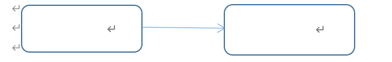

# java 学习总结

时间：2022年4月30号

# 1 基础语法

## 1.1 定义合法标识符**规则（必死记）**：

```java
/*
	1 由26个英文字母大小写，0-9 ，_或 $ 组成 
	2 数字不可以开头。
	3 不可以使用关键字和保留字，但能包含关键字和保留字。
	4 Java中严格区分大小写，长度无限制。
	5 标识符不能包含空格。
*/
```

## 1.2 标识符命名规范

标识符的命名**规范（死得快或者混的惨）**

在起名字时，为了提高阅读性，要尽量有意义，“**见名知意**”

```java
/*
	包名：多单词组成时所有字母都小写：xxxyyyzzz
	类名、接口名：多单词组成时，所有单词的首字母大写：XxxYyyZzz
	变量名、方法名：多单词组成时，第一个单词首字母小写，第二个单词开始每个单词首字母大写：xxxYyyZzz
	常量名：所有字母都大写。多单词时每个单词用下划线连接：XXX_YYY_ZZZ
*/
```

## 1.3 关键字、保留字、特殊值

```java
/*
	关键字、保留字和特殊值：全部小写（50+3）
	（1）关键字：在Java中被赋予的特定含义的单词。
		基本数据类型相关（8个）：byte、short、int、long、float、double、char、boolean
		流程控制语句相关（10个）：if、else、switch、case、default、break、for、while、do、continue
		判断某个对象是否是某种类型的实例对象运算符：instanceof
		定义类：class
		创建类的对象：new
		包相关：package、import
		权限修饰符：public、protected、（缺省）、private
		继承类：extends
		定义接口：interface
		实现接口：implements
		当前对象：this
		父类引用：super
		表示无返回值：void
		结束方法：return
		定义枚举：enum
		其他修饰符：abstract、static、final、native
		异常处理：try、catch、finally、throws、throw
		多线程同步和安全：synchronized、volatile
		和IO序列化相关：transient
		和单元测试相关：assert
		其他：strictfp
				strictfp 关键字可应用于类、接口或方法。
				如果你想让你的浮点运算更加精确，严格遵守FP-strict的限制,符合IEEE-754规范，
				而且不会因为不同的硬件平台所执行的结果不一致的话，可以用关键字strictfp.
	（2）保留字：在Java中注册但还未使用：goto、const
	（3）特殊值：true、false、null
*/
```

## 1.4  变量

```java
/*
变量：
某个值在程序中不同的地方都在使用，那么这个值就用一个变量保存。可以使用变量名来代表这个值。
变量本质对代表内存的一块存储区域。

变量的三要素：
1、变量名 
	比喻：房主，地址
2、数据类型（决定区域的大小，决定里面存的是什么类型的值）
	比喻：面积，用途
3、变量值
	比喻：里面的内容

如何使用变量？
1、变量必须先声明后使用
声明变量的格式：
数据类型 变量名;
例如：int age;
	  int num;
	  double score;
2、变量的使用之前，还必须初始化	  
变量赋值的格式：
	变量名 = 变量值;

变量的声明和初始化可以在同一个语句完成。
例如：int age = 18;	

3、变量有作用域
从声明处开始，到它所属的}结束

同一个作用域中不能重复声明
（1）同一个作用域中，一个变量声明一次
（2）同一个作用域变量不能重名
*/
class BianLiang{
	public static void main(String[] args){
		//声明变量
		int age;
		
		//变量的赋值，第一次赋值叫做初始化
		age = 18;
		System.out.print("现在年龄：" + age);
		System.out.print("明年的年龄：" + (age+1));
	}
	
	/*
	//age超过作用域
	public static void test(){
		System.out.print("现在年龄：" + age);
	}
	*/
}

```

## 1.5 数据类型

哪些地方需要数据类型：变量（形参属于局部变量）、返回值


```java
/*
	Java的数据类型：
	（1）基本数据类型（8种）
	（2）引用数据类型：类、数组、接口...
	
	一、基本数据类型（8种）
	bit：位，计算机中只有0和1，最小的存储单位
	byte：字节，一个字节 = 8 位
	1、数值型
	（1）整型（整数）
	byte：字节  1个字节  -128~127
	short：短整型 2个字节 -32768~32767
	int：整型（默认类型）4个字节 
	long：长整型 8个字节
	特殊：long类型的数字后面需要加L或l
	
	（2）浮点型（小数）
	float：单精度浮点型（4个字节）
		科学记数法：356.78   3.5678*10^2
		大约是：小数点后6~7位
	特殊：float类型的数字后面需要加F或f	
	double：双精度浮点型（8个字节）默认类型
		大约是：小数点后15~16位
	
	2、字符型
	char：字符型  2个字节	因为Java中所有的字符都使用Unicode字符集
		Java中每一个字符，都有一个唯一的Unicode编码值。
		可以存储一个字母，一个汉字，一个其他的字符
	字符类型的值要使用单引号引起来''
	字符串类型的值要使用双引号引起来""	
	char c = 'a';
	char s = '女';
	char line = '\n';//转义字符
	char tab = '\t';
	char d = '\b';
	char b = '\'';
	char b = '\"';
	
	char c = '\u5c1a';//Unicode编码值的十六进制形式
	
	3、布尔型，逻辑型
	boolean：只有两个值，true和false
*/
class LeiXing{
	public static void main(String[] args){
		byte b = 127;
		System.out.println("b = " + b);//""中的内容原样输出
		
		long num = 123456789012345678L;
		System.out.println("num=" + num);
		
		float f = 3.1F;
		System.out.println("f=" + f);
		
		double d = 3.1415926531234;
		System.out.println("d=" + d);
		
		//char gender = '女';
		//String sex = "女";
		//System.out.print("a\tb\nc\b");
		
		char c = '尚';//char c = '\u5c1a';
		System.out.print(c);
		
		boolean beautiful = false;
		if(beautiful){
			System.out.println("柴老师是大美女");
		}else{
			System.out.println("柴老师是大大美女");
		}
	}
}

```

## 1.6 变量的运算之数据类型之间的转换

* 自动类型转换（自动升级）：小容量转为大容量（系统自动完成）
  * byte,short,char --> int -->long -->float -->double
  * byte，short，char三者之间不进行运算，若运算都将自动升级为int再做运算
  * boolean不与其他任意数据类型转换
  * 任何数据类型与String之间使用“+”运算符都将自动“连接”成String类型

* 强制类型转换：
  * 大容量转小容量，需要使用强制符()，结果可能损失精度或溢出

```java
/*
	基本类型的转换：
	（1）自动类型转换
	byte,short,char             --> int       -->long   --> float --> double
	1个字节，2个字节，2个字节       4个字节    8个字节      4个字节   8个字节
	说明：
	byte,short,char之间是互不转换的，包括byte+byte等运算也会变成int
	boolean和谁都不转
	String类型的数据与任意类型的数据“+”拼接后结果都是String字符串
	
	ASCII码：
	小写字母a：97
	小写字母b：98
	
	大写字母A：65
	大写字母B：66
	
	数字0：48
	数字1：49
	
	（2）强制类型转换
	double --> float --> long -->int -->byte,short,char
	需要强制类型转换符()
	注意：强制类型转换可能损失精度或溢出
*/
class TypeChange{
	public static void main(String[] args){
		byte b = 127; //把127赋值给b，存储到b变量中
		int num = b; //把变量b中的值复制一份给num，也是说把变量b中的值赋值给num
		System.out.println("b = " + b);
		System.out.println("num = " + num);
		
		char c = 'a';//Unicode编码值，兼容ASCII码
		int letter = c;
		System.out.println("c = " + c);//a
		System.out.println("letter = " + letter);//97
		
		byte b1 = 1;
		byte b2 = 2;
		byte b3 = (byte)(b1 + b2);
		System.out.println("b3 = " + b3);
		
		char c1 = 'a';
		char c2 = (char)(c1 + 1);
		System.out.println("c2 = " + c2);
		
		double d = 10.56;
		int a = (int)d;
		System.out.println("a = " + a);//损失精度
		
		int age = 130;
		byte bb = (byte)age;//溢出
		System.out.println("bb = " + bb);
	}
}
```

# 2 进制及三码

## 2.1 进制

* 计算机中任何的计算和存储都是以二进制方式实现的
  * 位（bit） — 是计算机中最小的存储单位
  * 字节（byte） — 计算机中基本的存储单元  
  * 1byte = 8bits、1KB = 1024Byte、1MB = 1024KB、1GB = 1024MB、1T = 1024GB 、 1PB  = 1024TB
* 对于整数，有四种表示方式：
  * 二进制：0,1 ，满2进1.以0b或0B开头（字母B大小写均可）。
  * 十进制：0-9 ，满10进1.
  * 八进制：0-7 ，满8进1.八进制数被冠以0来表示。
  * 十六进制：0-9及A-F，满16进1，十六进制数被冠以0X来表示（字母X大小写均可）
      * 如： 0x3f20（十六进制）   0732 （八进制）

```java
public class JinZhi{
	public static void main(String[] args){
		//最终打印的结果是十进制
		System.out.println("十进制：" + 10);
		System.out.println("二进制：" + 0B10);
		System.out.println("八进制：" + 010);
		System.out.println("十六进制：" + 0X10);
	}
}
```

## 2.2 原码、反码、补码

* 1、原码

  * 即用第一位表示符号, 其余位表示值. 比如如果是8位二进制(byte类型就是):
  * +1 00000001【原码】
  * -1 10000001【原码】

* 2、反码

  * 正数的反码是其本身
    * +1 10000001【反码】

  * 负数的反码是在其原码的基础上, 符号位不变，其余各个位取反.
    * -1 11111110【反码】

* 3、补码

  * 正数的补码就是其本身
    * +1 00000001【补码】

  * 负数的补码是在其原码的基础上, 符号位不变, 其余各位取反, 最后+1. (即在反码的基础上+1)
    * -1 11111111【补码】

* 总结：正数：三码合一，负数：原码最高位为1、反码在原码基础上除符号位外取反、补码在反码基础上+1（原码取反+1）

## 2.3 使用原因？

为什么要使用原码、反码、补码表示形式呢？

计算机辨别"符号位"显然会让计算机的基础电路设计变得十分复杂! 于是人们想出了将符号位也参与运算的方法. 我们知道, 根据运算法则减去一个正数等于加上一个负数, 即: 1-1 = 1 + (-1) = 0 , 所以机器可以只有加法而没有减法, 这样计算机运算的设计就更简单了.

# 3 运算符

* 1、算术运算符
* 2、赋值运算符
* 3、比较运算符（关系运算符）
* 4、逻辑运算符
* 5、条件运算符
* 6、位运算符
* 表达式：操作数+运算符

## 3.1 算术运算符

```java
/*
	算术：arithmetic
	一、算术运算符
	（1）加：+
	（2）减：-
	（3）乘：*
	（4）除：/  
		特殊：如果是两个整数相除，结果只保留整数部分
	（5）取余，取模：%   被模数%模数
		特殊：模数的负号被忽略
	
	（6)在JAVA中：+ 还表示拼接
	只要+两边有一个是字符串，那么就是拼接，结果仍然是字符串
	a + "+"：a变量的值 拼接上 “+”符号  23+
	
	（7）正号 +
	（8）负号 - 
	
	（9）自增 ++
		对于自增变量本身来说，++在前或在后都一样，自增变量都要加1
		i++或++i，i就是自增变量
		
		对于表达式来说，i++和++i不一样的，++在前，先自增，再进行其他运算，++在后，先进行其他运算，然后再自增
	（10）自减 --
	同自增
*/
class SuanShu{
	public static void main(String[] args){
		int a = 23;
		int b = 12;
		System.out.println(a + "+" + b + "=" + (a+b));
		int sum = a + b;
		System.out.println(a + "+" + b + "=" + sum);
		
		int sub = a - b;
		//System.out.println(a + "-" + b + "=" + a-b);//错误，原因是a + "-" + b + "=" + a的结果是字符串，字符串不能进行减法
		System.out.println(a + "-" + b + "=" + (a-b));
		System.out.println(a + "-" + b + "=" + sub);
		
		int mul = a * b;
		System.out.println(a + "*" + b + "=" + a*b);
		System.out.println(a + "*" + b + "=" + mul);
		
		//整数相除，只保留整数部分
		int div = a / b;
		System.out.println(a + "/" + b + "=" + a/b);
		System.out.println(a + "/" + b + "=" + div);
		
		double d = (double)a/b;//先把a的类型进行转换，转换成double类型，然后再和b相除
		System.out.println(a + "/" + b + "=" + d);
		
		int yu = a % b;
		System.out.println(a + "%" + b + "=" + yu);
		
		System.out.println("------------------特殊的取模----------------------");
		System.out.println(5%2);//1
		System.out.println(-5%-2);//-1
		System.out.println(-5%2);//-1
		System.out.println(5%-2);//1
		
		System.out.println("------------------负号----------------------");
		int num1 = 12;
		int num2 = -num1;
		System.out.println("num2=" + num2);
		
		System.out.println("------------------自增----------------------");
		int i = 0;
		System.out.println("自增之前i=" + i);
		i++;
		System.out.println("自增第一次之后i=" + i);
		++i;
		System.out.println("自增第二次之后i=" + i);
		int j = ++i;//把i自增1，然后结果赋值给j，或者说，先算++i，然后再赋值
		System.out.println("自增第三次之后i=" + i);
		System.out.println("j="+j);
		int k = i++;//先算赋值，把i的值赋值给k，i原来是3，把3赋值给k，然后i在自增1，i变成4
		System.out.println("自增第四次之后i=" + i);
		System.out.println("k="+k);
		
		//面试题：陷阱题
		i = i++;//先赋值，把i原来的值重新赋值给i，不变，然后i自增，但是这个自增后的值没有在放回变量i的位置
		System.out.println("自增第五次之后i=" + i);
	}
}
```

## 3.2 赋值运算符

* 基本的赋值运算符：=

* 扩展的赋值运算符：+=  -=  *=  /=  %=  &=  ....

* 扩展的赋值运算符的说明：中间不能有空格，而且结果隐含数据类型转换

  * 例如：

    short s1 = 1;
    short s2 = 2;
    s2 += s1;

```java
/*
	赋值：assign
	最基本的赋值运算符：=
	
	Java中赋值，永远是把等号=右边的赋值给左边的变量。
	右边如果是常量值，那么就把常量的值直接赋值给左边的变量；
	右边如果是变量，那么就把变量的值直接赋值给左边的变量；
	右边如果是表达式，那么就把表达式的运算结果直接赋值给左边的变量；
	
	扩展的赋值运算符：
	+=，-=，*=，/=，%= 
	注意：
	（1）+=等，中间是不能有空格的，即不能写成 + =
	（2）如果结果的类型与左边的变量不在一样时，隐含了强制类型转换
	
*/
class FuZhi{
	public static void main(String[] args){
		int a = 10;//把10赋值给a
		int b = a; //把a的值赋值给b
		int c = a + b;//把a+b的运算结果赋值给c
		
		//20 = a;//错误的
		
		System.out.println("-------------------------------");
		byte b1 = 1;
		byte b2 = 127;
		//b2 = b1 + b2;//右边的结果是int类型，需要强制类型转换
		b2 += b1;//把左边的变量的值 + 右边的变量的值，结果再赋值给左边的变量，如果计算的结果是升级后的结果，会强制类型转换
		System.out.println("b1=" + b1);
		System.out.println("b2=" + b2);
		
		System.out.println("-------------------------------");
		int i = 2;
		int j = 3;
		j *= i + 1;//等价于  j = j * (i+1);
		System.out.println("i=" + i);
		System.out.println("j=" + j);
		
		System.out.println("-------------------------------");
		int m = 2;
		int n = 3;
		n *= m++;// (1)n = n * m; (2)m++;
		System.out.println("m=" + m);//对于自增变量来说，++在前还是在后都要自增1
		System.out.println("n=" + n);
		
		System.out.println("-------------------------------");
		int x = 2;
		int y = 3;
		y *= ++x;// (1)++x; (2)y = y * x;
		System.out.println("x=" + x);//对于自增变量来说，++在前还是在后都要自增1
		System.out.println("y=" + y);
		
		System.out.println("-------------------------------");
		i = 1;
		i *= 0.1;//把double类型强制转换成int
		System.out.println(i);//0
		i++;
		System.out.println(i);//1
	}
}
```

## 3.2 关系运算符

* 关系运算符，比较运算符：运算的结果只有true或false的布尔值

  * （1）> <  >= <= !=
  * （2）== 判断是否相等，一定要与=赋值运算符区分开
  * （3）instanceof，引用数据类型的关系运算符后面再讲

  ```java
  /*
  	比较：compare
  	关系：relation
  	
  	比较运算符又称为关系运算符：
  	1、大于：>
  	2、小于：<
  	3、大于等于：>=(中间不能有空格)
  	4、小于等于：<=
  	5、是否等于：==
  	6、是否不等于：!=
  	
  	条件判断时，常常使用比较运算符
  	
  	比较运算符的表达式的结果只有两种：true或false，即结果是一个boolean值
  */
  class BiJiao{
  	public static void main(String[] args){
  		int age = 19;
  		
  		System.out.println(age >= 18);
  		System.out.println(age < 18);
  		
  		System.out.println("------------------------------");
  		
  		System.out.println(age == 18);//比较运算符的表达式，结果是true
  		System.out.println(age = 18);//赋值表达式，结果是18
  		
  		boolean result = false;
  		if(result = true){//变成了一个赋值表达式
  			System.out.println("条件成立");
  		}
  		System.out.println("result="+result);
  		
  		/*
  		编译错误(age=18)不是比较表达式，结果也不是true或false，条件只能是布尔值
  		if(age = 18){
  			System.out.println("刚刚成年");
  		}
  		*/
  				
  		/*
  		if(age>=18){
  			System.out.println("欢迎进入成人世界！");
  		}else{
  			System.out.println("未成年不允许进入！");
  		}
  		*/
  	}
  }
  ```

## 3.4 逻辑运算符

* & 与
* | 或
* ! 非
* && 短路与
* || 短路或
* ^ 异或不同为真，相同为假

```java
/*
	逻辑：logic,logical
	逻辑运算符：
	(1)逻辑与：&
		表示&左右两边的条件要同时成立
		true & true 结果才为true
		true & false 结果为false
		false & true 结果为false
		false & false 结果为false
	(2)逻辑或： |
		表示|左右两边的条件只要有一个成立就可以
		false | false 结果为false
		false | true 结果为true
		true | false 结果为true
		true | true 结果为true
	(3)逻辑非：!
		!false 结果为true
		!true 结果为false
	(4)	逻辑异或：^
		^左右两边的条件的结果相反时为true
		true ^ true 结果为false
		true ^ false 结果为true
		false ^ true 结果为true
		false ^ false 结果为false
	(5)短路与：&&	
		表示&&左右两边的条件要同时成立
		true && true 结果才为true
		true && false 结果为false
		false && true 结果为false
		false && false 结果为false
		同逻辑与&有所不同：当&&左边的表达式为false时，右边的表达式不看了
	(6)短路或：||	
		表示||左右两边的条件只要有一个成立就可以
		false || false 结果为false
		false || true 结果为true
		true || false 结果为true
		true || true 结果为true	
		和逻辑或|有所不同：当||左边的表达式为true时，右边的表达式不看了
		
	二元运算符：运算符需要两个操作数
			a + b， a * b，  a = b， a > b，...
	一元运算符： 运算符需要一个操作数
		++，--，正号，负号
		i++，+a
*/
class Logic{
	public static void main(String[] args){
		//成绩
		int score = -75;
		
		//如果成绩在80~90之间，我们显示成绩良好
		//80<=score<=90
		/*错误
		if(80 <= score <= 90){
			System.out.println("良好");
		}
		*/
		
		if(score>=80 & score<=90){
			System.out.println("良好");
		}
		
		//如果成绩小于0或大于100，我们显示超过合理的成绩范围
		if(score<0 | score>100){
			System.out.println("超出成绩范围");
		}
		System.out.println("------------------------------------");
		System.out.println(true & true);//true
		System.out.println(true & false);//false
		System.out.println(false & true);//false
		System.out.println(false & false);//false
		
		System.out.println("------------------------------------");
		System.out.println(true | true);//true
		System.out.println(true | false);//true
		System.out.println(false | true);//true
		System.out.println(false | false);//false
		
		System.out.println("------------------------------------");
		int num = 100;
		boolean flag = num<100 | num>100;
		System.out.println("flag = " + flag);
		if(!flag){
			System.out.println("num等于100");
		}
		System.out.println("------------------------------------");
		System.out.println(true ^ true);//false
		System.out.println(true ^ false);//true
		System.out.println(false ^ true);//true
		System.out.println(false ^ false);//false
				
		System.out.println("------------------------------------");
		int i = 0;
		int j = 1;
		if(i>0 && ++j > 1){
			i = 20;
		}
		System.out.println("i=" + i);
		System.out.println("j=" + j);
	}
}
```

## 3.5 三元条件运算符

* 三元运算符：格式  条件表达式?表达式1:表达式2

* 注意条件表达式结果必须是布尔类型

* 当条件表达式的结果为true,那么整个三元运算符的结果就取表达式1的结果，否则就取表达式2的结果

```java
//找出三个整数中的最大值
public class FindMax{
	public static void main(String[] args){
		int x = 3;
		int y = 2;
		int z = 5;
		
		int max = x>=y ? x : y;
		//运行到这里，max中存的是x,y中较大者
		
		max = max >= z ? max : z;
		
		System.out.println("max = " + max);
	}
}
```

## 3.6 位运算符

* 位运算符：操作数是**整数**
* 左移 << ：右边补0
  * 左移几位，乘以2的几次方
* 右移 >> ：左边补0或1，原数最高位是1，就补1，原数最高位是0，就补0
  * 右移几位，除以2的几次方
* 无符号右移 >>>：左边补0
  * 对于正数来说，结果和>>一样，
  * 对于负数来说，>>>后变成正数
* 按位与 & ：二进制对应位置取与 ，同时为1才为1，否则为0
* 按位或 | ：二进制对应位置取或 ，有一个为1就为1
* 按位异或运算 ^ ：二进制对应位置取异或 ，两者不同才为1
* 按位取反 ~ ：二进制对应位置取反 ，原来是1，变为0，原来是0变为1
* 说明：位运算符都是**机器数**直接运算的

```java
public class BitOperator{
	public static void main(String[] args){
		int a = 8;
		
		//a的二进制：24个零 0000 1000
		//a<<2
		//24个零 0010 0000
		System.out.println(a << 2);
		
		//a的二进制：24个零 0000 1000
		//a>>2
		//24个零 000000 10
		System.out.println(a >> 2);
		
		int b = -8;
		//b的二进制：
		//原码 1 23个0 0000 1000
		//反码：1 23个1 1111 0111
		//补码：1 23个1 1111 1000
		//左移b<<2，右边补0
		//1 23个1 1110 0000 补码
		//反码：1 23个1 1101 1111
		//原码：1 23个0 0010 0000  -32
		System.out.println(b << 2);
		
		//b的二进制：
		//原码 1 23个0 0000 1000
		//反码：1 23个1 1111 0111
		//补码：1 23个1 1111 1000
		//右移：b>>2，左边补什么，看最高位，
		//补码：1 23个1 111111 10
		//反码：1 23个1 111111 01
		//原码：1 23个0 0000 0010  -2
		System.out.println(b >> 2);
		
		//无符号右移
		//b的二进制：
		//原码 1 23个0 0000 1000
		//反码：1 23个1 1111 0111
		//补码：1 23个1 1111 1000
		//无符号右移：b >>> 2,不看最高位，左边直接补0
		//00 1 23个1 1111 10
		System.out.println(b >>> 2);
		
		System.out.println("-----------------------------");
		//a的二进制：24个零 0000 1000
		//b的二进制：
		//原码 1 23个0 0000 1000
		//反码：1 23个1 1111 0111
		//补码：1 23个1 1111 1000
		//24个零 0000 1000 & 1 23个1 1111 1000 
		//24个零 0000 1000 -》 8
		System.out.println(a & b);
		
		//24个零 0000 1000 | 1 23个1 1111 1000 
		//1 23个1 1111 1000 ->-8
		System.out.println(a | b);
		
		//24个零 0000 1000 | 1 23个1 1111 1000 
		//24个1 1111 0000补码
		//反码：24个1 1110 1111 
		//原码：1 23个0 0001 0000 -》 -16
		System.out.println(a ^ b);
		
		//a的二进制：24个零 0000 1000
		//~a
		//24个1 1111 0111补码
		//反码：24个1 1111 0110
		//原码：1 23个0 0000 1001
		System.out.println(~a);
	}
}
```

## 练习 进制转换

```java
public static void main(String[] args) {
		//方式一：自动实现
		String str1 = Integer.toBinaryString(60);
		String str2 = Integer.toHexString(60);
		System.out.println("60的二进制形式" + str1);
		System.out.println("60的十六进制形式" + str2);

		//方式二：手动实现
		int num = 60;
		int temp = num&15;
		String r = (temp > 9)? (char)(temp-10 + 'A')+"" : temp+"";
		
		temp = num >>> 4;
		temp = temp & 15;
		String l = (temp > 9)? (char)(temp-10 + 'A')+"" : temp+"";
		System.out.println("60的十六进制形式" + l + "" + r);
	}

```

# 3 流程控制语句结构

## 3.1 顺序结构

```java
/*
	流程控制语句结构：
	1、顺序：（在同一个方法中）从上往下执行
		从键盘输入一个值，并打印输出
	2、分支
	3、循环
	
	用核心类库中的类：String,System,Math,Scanner等
	如果这个类型定义在java.lang包下，那么直接使用，无需导包，直接使用简名称
	但是如果这个类型定义在其他包下，那么需要写全名称或导包
	全名称：java.util.Scanner
*/
//导包语句：
//格式：import 包.类名;
//位置：必须在源文件的上面，在class的上面
import java.util.Scanner;

class TestStatement{
	public static void main(String[] args){
		System.out.println("欢迎使用尚硅谷登记系统：");
		System.out.println("请输入个人信息：");
		
		//System.out.println(Math.pow(2,3));
		
		//Scanner键盘输入的工具类
		//input是一个变量名，自己命名
		//方式一：全名称
		//java.util.Scanner input = new java.util.Scanner(System.in);
		
		//方式二：导包，简名称
		Scanner input = new Scanner(System.in);
		
		System.out.print("请输入年龄：");		
		int age = input.nextInt();		
		System.out.println("您的年龄是：" + age);
		
		System.out.print("请输入入学成绩：");		
		double score = input.nextDouble();		
		System.out.println("您的分数是：" + score);
		
		System.out.print("请告知我是否帅/美：");		
		boolean	flag = input.nextBoolean();		
		System.out.println("帅/美否：" + flag);
		
		System.out.print("请输入您的姓名：");
		String name =  input.next();
		System.out.println("您的名字是："+name);
	}
}
```

## 3.2 复合语句

* 与C语言及其他语言相同，Java语言的复合语句是以整个块区为单位的语句，所以又称为块语句。

* 复合语句由开括号“{”开始，闭括号“}”结束。

* 复合语句中的每一语句都是从上到下执行。复合语句以整个块为单位，并且在复合语句中可以嵌套复合语句。

```java
Java代码结构：
class 类{
	{	
		//代码块
	}
	方法签名{
		//方法体
	}
	内部类{
		内部类体
	}
}
```

* 复合语句为变量创建了一个作用域。在该作用域中某个变量被创建并能够使用，如果在某个变量的作用域外使用该变量，则会发生错误。

## 3.3 分支结构

### 3.3.1 if 条件语句

```java
	public static void main(String[] args) {
		int score = 89;
		if(score>90){
			System.out.println("优秀");
		}else if(score>80){
			System.out.println("良好");
		}else if(score>60){
			System.out.println("及格");
		}else{
			System.out.println("不合格");
		}
	}


	public static void main(String[] args) {
		int score = 89;
		if(score>90 && score<=100){
			System.out.println("优秀");
		}else if(score>80 && score<=90){
			System.out.println("良好");
		}else if(score>60 && score<=80){
			System.out.println("及格");
		}else{
			System.out.println("不合格");
		}
	}

```

### 3.3.2 选择结构

注意：
（1）表达式返回的结果类型只能是byte，short，char，int，枚举（JDK1.5之后），String（JDK1.7之后）
（2）表达式返回的结果的类型需要与case后的值的类型保持一致
（3）case后面只能跟常量值，不能是变量值或不确定的表达式值
（4）同一个switch语句，case的常量值必须互不相同
（5）break是可选的，当表达式返回结果与某个case后的值进行匹配成功后，执行相应分支的语句，一旦进入某个分支后，只有直到遇到break才会退出switch，否则将会继续执行下一个case的语句。
（6）default是可选的。位置也不一定是最后，也可以在任意case的位置。但是不管再哪里，都是要所有case的常量值不匹配后才会进入default分支，一旦进入default分支，也是需要遇到break或switch的闭括号“}”才会停止。
总结：switch的入口，表达式值与某个case匹配，或都不匹配，从default进入。
      switch的出口，遇到break或者switch的闭括号“}”结束

```java
switch(表达式){
	case 常量值1：
	//执行语句块1
	[break;]
	case 常量值2：
	//执行语句块2
	[break;]
		......
	case 常量值n：
	//执行语句块n
	[break;]
	【default：
	//执行缺省语句
	[break;]
	】
}

switch(2){
		case 1:{
			System.out.println(1);
			System.out.println("代码块");
		}
		case 2:
			System.out.println(2);
		case 3:
			System.out.println(3);
}
```

* 当条件判断是等值判断，并且表达式的结果是byte,short,char,int,枚举,String类型的时候，用switch会更合适，

* 其他都使用条件判断

* 可以使用switch...case的，肯定可以使用if...else，返回来不一定。

## 3.5 循环结构

三种循环语句的语法

#### 3.5.1 while循环语句

```java
语法结构：
while(条件表达式){
//循环体语句块
}
执行过程：
（1）先判断循环条件
（2）条件成立，执行循环体语句块
（3）回到（1）
（4）直到条件不成立，结束while循环
```

#### 3.5.2 do...while循环语句

```java
语法结构：

do{

//循环体语句块

}while(条件表达式);

执行过程：

（1）先无条件执行一次循环体语句块

（2）再判断循环条件

（3）条件成立，再次执行循环体语句块

（4）回到（2）

（5）直到条件不成立，结束do...while循环

先执行一次循环体后，再判断条件，如果条件成立，继续下一次循环体，因此do...while循环至少执行一次循环体。
```

 #### 3.5.3 for循环结构

```java
语法结构：
for(初始化表达式1; 循环条件表达式2; 迭代表达式3){
//循环体语句块
}
执行过程：
（1）执行初始化表达式1
（2）判断循环条件表达式2
（3）如果条件成立，执行循环体语句块
（4）执行迭代表达式3
（5）重复（2）（3）（4）（5）
（6）直到循环条件不成立，结束for循环
注意：
	两个分号必不可少
	三个表达式可以省略，但要结合break，否则死循环。
	表达式1可以有多个变量声明，但必须是同一个类型，用逗号分隔
	表达式3可以有多个变量更新，用逗号分隔
```

#### 3.5.4 foreach循环结构（后面数组和集合部分再讲）

```java
语法结构：

for(元素类型 元素临时名：数组/集合){

//循环体

}
```

for循环适用于循环次数比较明确的，而do...while适用于至少执行一次的循环。while适用于循环条件比较明确的。

## 3.6 嵌套循环

例如：找出1000以内的所有完数

```java
for(int i=1; i<=1000;i++){

 //i是否是完数

 //如果是，就打印i，如果不是就不打印i

   }

   （2）i是否是完数的判断，要把i的所有因子找出来，并相加
     int sum = 0;

 for(int j=1; j<i; j++){

 if(i%j==0){

 sum += j;

 }

    }

   （3）如果是，就打印i

    if(sum == i){

 System.out.println(i);

    }
```

## 3.7 跳转

break

continue

return

```java
跳转
/*    
	break：只能用在switch或循环中，用于跳出所在的当层循环或switch
	continue：只能用于循环中，提前结束本次循环，继续下一次循环
	return：用于结束当前方法
*/    
public class TestBreakAndContinue {
	public static void main(String[] args) {
		for (int i = 1; i <=5; i++) {
			for (int j = 1; j <=5; j++) {
				System.out.print("*");
				if(i==j){
					break;
				}
			}
			System.out.println();
		}
	}
}

```

## 3.8 标签（了解）

```java
public class TestBreakAndContinue {
	public static void main(String[] args) {
		out:for (int i = 1; i <=5; i++) {
			for (int j = 1; j <=5; j++) {
				System.out.print("*");
				if(i==j){
					System.out.println();
					continue out;
				}
			}
		}
	}
}
```

# 4 数组

```java
//无论是静态初始化还是动态初始化必须确定数组长度。

//静态初始化
int[] arr = new int[]{1,2,3,4,5,6};
//错误 
//int[] arr = new int[5]{1,2,3,4,5,6};
int[] arr = {1,2,3,4,5,6};//简写
String[] arr = {“hello”,”java”,”world”};


//动态
int[] arr = new int[10];
arr[2]=1;
//未赋值默认为0
System.out.println(Arrays.toString(arr));

// 这样会导致arr被重新定义，arr= new int[]{1,2,3};
```


## 4.1 数组的相关概念[了解]

* 所谓数组(Array)，就是相同数据类型的元素按一定顺序排列的集合，

* 就是把有限个类型相同的变量用一个名字命名，以便统一管理他们，然后用编号区分他们，这个名字称为数组名，编号称为下标或索引(index)。

* 组成数组的各个变量称为数组的元素(element)。数组中元素的个数称为数组的长度(length)。
* 例如：int s1_score = 80; int s2_score = 90; int s3_score = 87; .....
  *  int[] scores = {80,90,87,68,99,100,79,96};   元素1：scores[0]=80;  数组的长度为8

## 4.2 数组的特点[掌握]

* 1、数组的长度一旦确定就不能修改

* 2、创建数组对象会在内存中开辟一整块连续的空间。而数组名中引用的是这块连续空间的首地址。

* 3、遍历数组和获取某个元素的速度快，因为可以通过数组名+下标，直接定位到任意一个元素。

## 4.3 数组类型与数组元素的类型[理解]

* 数组中的元素可以是任何数据类型，包括基本类型和引用类型

* 数组属引用类型，把数组看成对象(object)，数组中的每个元素相当于该对象的成员变量。

* 例如：
  * （1）基本数据类型元素的数组
    * int[] scores = {80,90,87,68,99,100,79,96};
    * scores数组的类型是：int[]，元素的类型是int
    * scores是一个对象，scores[0],scores[1]等元素是scores对象的成员变量
  * （2）引用数据类型元素的数组
    *  String[] strings = {“hello”,”java”,”world”,”array”};
    *  strings数组的类型是：String[]，元素的类型是String
    * strings是一个对象，strings[0]，strings[1]等元素是strings对象的成员变量

## 4.4 数组的分类[了解]

数组按照维度分为：一维数组、二维数组、多维数组

数组按照元素的数据类型分：基本数据类型元素的数据，引用数据类型元素的数组（也称为对象数组）

## 4.5 一维数组的声明[掌握]

数组的声明：

数组类型 数组名;  即  元素数据类型[] 数组名;

例如：int[] arr;  String[] arr; Student[] arr;

说明：也有如下写法： 元素数据类型 数组名[];

例如：int []arr;  int arr[];  Student arr[];

### 4.5.1 一维数组的初始化[掌握]

* 静态初始化

```java
数组名 = new 元素数据类型[]{元素1的值，元素2的值，....};
说明：
（1）静态初始化时数组的长度由{}中罗列的元素的个数决定
（2）静态初始化时[]中不可以再写长度
（3）如果声明与初始化一起，可以简写：
元素数据类型[] 数组名 = {元素1的值，元素2的值，....};
例如：int[] arr = {1,2,3,4,5,6};
      String[] arr = {“hello”,”java”,”world”};
      Student[] arr = {new Student(“貂蝉”), new Student(“王昭君”, new Student(“西施”),new Student(“杨玉环”) };

一维数组静态初始化案例：
    升景坊单间短期出租4个月，550元/月（水电煤公摊，网费35元/月），空调、卫生间、厨房齐全。屋内均是IT行业人士，喜欢安静。所以要求来租者最好是同行或者刚毕业的年轻人，爱干净、安静。
public class ArrayTest {
      public static void main(String[] args) {
      int[] arr = new int[]{8,2,1,0,3};
      int[] index = new int[]{2,0,3,2,4,0,1,3,2,3,3};
      String tel = "";
      for(int i = 0;i < index.length;i++){
            tel += arr[index[i]];
      }
      System.out.println("联系方式：" + tel);
      }
}

```

* 动态初始化

```java
数组名 = new 元素数据类型[数组的长度];
说明：
（1）动态初始化时数组的长度在[]中指定，而且必须指定
（2）动态初始化时每一个元素有默认值
注意：
（1）无论是静态初始化还是动态初始化必须确定数组长度。
动态初始化在创建数组对象时，显式指明长度，静态初始化，由列出的元素个数确定数组的长度
（2）int[] arr = new int[5]{1,2,3,4,5};//错误
（3）int[5] arr ;//错误
（4）数组的长度一旦确定，不可改变
（5）元素的数据类型是引用数据类型，在刚刚动态初始化后，元素的值是null，并没有创建元素的对象，元素的对象需要单独创建。
例如：Student[] arr = new Student[3];此时arr[i]为null，arr[i]并没有指向任何学生对象，此时arr[i].属性或arr[i].方法都会报空指针异常
String[] arr = new String[3];此时arr[i]也为null，arr[i]中并没有存储任何字符串对象

```

##4.6 数组常用工具类Arrays

`System.arraycopy(原数组，开始位置，目标数组，开始位置，长度)：array的复制。`

```java
/*
	java.util.Arrays类包含了用来操作数组（比如排序和搜索）的各种方法。Arrays拥有一组static方法。
	equals(数组1，数组2)：比较两个array是否相等。array拥有相同元素个数，且所有对应元素两两相等。
	fill(数组名,填充的值)：使用某个值填充array数组。 
	fill(数组名,开始下标，结束下标，填充的值)：使用某个值填充array数组的某个部分。
	sort(数组名)：用来对array进行排序。 
	binarySearch(数组名，要查找的数据)：在排好序的array中寻找元素。 只能用于已经排好序的数组，返回下标
	toString(数组名)：打印一个数组，格式：[元素值1，元素值2....]
	copy(原数组，新数组的长度)：复制数组，从下标为0的元素开始复制，复制n个元素。不够就默认值填充
	copyOfRange(原数组，from，to)：复制数组任意部分，从from到to（不包含）个元素
	另：System.arraycopy(原数组，开始位置，目标数组，开始位置，长度)：array的复制。
*/
```

## 4.7 多维数组

```java
/*	
	格式：元素的数据类型[][]  二维数组名;
	例如：int[][] arr;   Student[][] students;

	通俗的理解：一维数组比喻成平房，就一层楼，有几间房
            二维数组比喻成楼房，有几层楼，每层楼各有几间房
*/
```

# 5 面向对象

##5.1 简介

* 面向过程：POP: Process-Oriented Programming

​     	以函数（方法）为最小单位

​     	以过程，步骤为主，考虑怎么做

​		c 语言

​     

* 面向对象：OOP: Object Oriented Programming

​     	以类/对象为最小单位，类包括：数据+方法

​     	以对象（谁）为主，考虑谁来做，谁能做

* 匿名对象
  我们也可以不定义对象的句柄，即引用变量，而直接调用这个对象的方法等，这样的对象叫做匿名对象。
  如：new Person().shout(); 
  使用情况：
  （1）如果对一个对象只需要进行一次方法调用，那么就可以使用匿名对象。 
  （2）我们经常将匿名对象作为实参传递给一个方法调用。 

本类中的方法可以直接访问本类中的成员变量。

## 5.2 属性的访问机制

* （1）本类中
  本类中的方法可以直接访问本类中的成员变量。
  **`特殊：static成员访问非static成员，编译不通过`**
* （2）跨类
  如果要访问其他类的成员，那么必须要通过“对象.成员”
  用户使用new操作符创建一个对象后，可以使用“对象.成员”来获取对象的属性和行为。
  例如：  Teacher tea = new Teacher();  tea.name = “柴林燕”;  tea.teacher();
  **特殊说明：如果被访问的类成员是static修饰的，那么可以使用“类名.类成员”访问的简化形式**
  **注意：跨类还要考虑访问权限的问题**

```java
public class TestAccess{
	public static void main(String[] args){
		Circle c1 = new Circle();
		c1.radius = 1.2;//跨类，那么必须要通过“对象.成员”
		
		Circle c2 = new Circle();
		c2.radius = 2.3;//跨类，那么必须要通过“对象.成员”
		
		//如果要访问其他类的成员，那么必须要通过“对象.成员”
		System.out.println("c1的半径为：" + c1.radius);
		System.out.println("c1的面积是：" + c1.getArea());
		
		System.out.println("c2的半径为：" + c2.radius);
		System.out.println("c1的面积是：" + c2.getArea());
	}
}
class Circle{
	double radius;
	
	//本类中的方法可以直接访问本类中的成员变量
	public double getArea(){
		return Math.PI * radius * radius;
	}
}
```

## 5.3 对象的内存分析


（1）new对象，等价于在**堆**中申请一块空间，用来存储该对象的专属信息

（2）对象的引用（对象名），等价于将该对象的**堆**内存的首地址存储在引用变量（对象名）中

##5.4 Java的内存管理

经常人把Java内存区分为堆内存（Heap）和栈内存（Stack），这种分法比较粗糙，Java内存区域的划分实际上远比这复杂。这种划分方式的流行是因为大多数程序员最关注的、与对象内存分配关系最密切的内存区域是这两块。

根据《Java虚拟机规范（第2版）》的规定，Java虚拟机所管理的内存将会包括以下几个运行时数据区域，如下图所示：


堆（Heap），此内存区域的唯一目的就是存放对象实例，几乎所有的对象实例都在这里分配内存。这一点在Java虚拟机规范中的描述是：所有的对象实例以及数组都要在堆上分配。

通常所说的栈（Stack），是指虚拟机栈。虚拟机栈用于存储局部变量表等。局部变量表存放了编译期可知长度的各种基本数据类型（boolean、byte、char、short、int、float、long、double）、对象引用（reference类型，它不等同于对象本身，是对象在堆内存的首地址）。 方法执行完，自动释放。

方法区（Method Area）用于存储已被虚拟机加载的类信息、常量、静态变量、即时编译器编译后的代码等数据。

## 5.5 Java的内存管理之垃圾回收

分配：由JVM自动为其分配相应的内存空间

释放：由JVM提供垃圾回收机制自动的释放内存空间

垃圾回收机制（GC：Garbage Collection）：将垃圾对象所占用的堆内存进行回收。Java的垃圾回收机制是JVM提供的能力，由单独的系统级垃圾回收线程在空闲时间以不定时的方式动态回收。

**垃圾对象**：不再被任何引用指向的对象。


面试题：

问在程序中是否可以通知垃圾回收机制过来回收垃圾？

能，通过调用System.gc();或Runtime.getRuntime().gc();

再问？调用了System.gc();或Runtime.getRuntime().gc();后是立刻执行垃圾回收吗？

不是，该调用并不会立刻启动垃圾回收机制开始回收，但会加快垃圾回收机制的运行。

```java
public class TestGC{
	public static void main(String[] args)throws Exception{
		for(int i=0; i<10; i++){
			MyClass m = new MyClass();//这里本次循环完，本次创建的对象就成为垃圾了
			System.out.println("创建第" + (i+1) + "的对象：" + m);
		}
		
		//通知垃圾回收机制来收集垃圾
		System.gc();
		
		//为了延缓程序结束
		for(int i=0; i<10; i++){
			Thread.sleep(1);
			System.out.println("程序在继续....");
		}
	}
}
class MyClass{
	//这个方法是垃圾回收机制在回收它的对象时，自动调用，理解成对象留临终遗言的方法
	public void finalize(){
		System.out.println("轻轻的我走了.....");
	}
}

```

## 5.6 面试题：实例变量与局部变量的区别？

（1）声明的位置不同：实例变量在类中方法外，局部变量在方法内或代码块内

（2）数据的存储位置不同：实例变量在堆中，局部变量在栈中

**（3）初始值的获得不同：实例变量有默认值，局部变量必须手动初始化**

（4）修饰符：实例变量可以多种修饰符，局部变量最多只能使用final

（5）作用域：实例变量（本类中直接访问，其他类通过对象访问），局部变量从声明处开始，到所属的}就结束

（6）生命周期：实例变量随着对象的创建而出生，对象被垃圾回收机制收回才被收回。局部变量是当代码执行超过作用域范围，该局部变量就失效。

## 5.7 方法参数的值传递机制

方法的参数传递机制：

方法的值传递机制：实参给形参传值

（1）基本数据类型形参：实参给形参传的是“数据值”，形参值的修改不会影响实参

（2）引用数据类型形参：实参给形参传的是“地址值”，形参对象的属性值修改会影响实参对象的属性值

## 5.8 方法重载（Overload）

方法的重载：在同一个类中，出现的多个方法名称相同，参数列表不同的情形称为方法重载。

关键词：

（1）在同一个类中多个方法

（2）方法名称必须相同

**（3）参数列表必须不同（参数的个数或数据类型不同）**

**注意：与返回值类型无关**

## 5.9 重写

方法的重写（Override）:当父类中的方法对于子类来说不适用的时，子类可以对父类中的方法进行重写/覆写。

**要求：两同两小一大**

**方法名：必须完全一致**

**参列表：必须完全一致**

返回值类型：

如果是基本数据类型和void，必须完全一致

如果是引用数据类型，必须是<=，即重写的方法的返回值类型<=被重写方法的返回值类型，Student<Person

修饰符：重写的方法的修饰符范围>=被重写方法的修饰符范围（public>protected>缺省>private）

抛出的异常：异常部分再讲 

补充：

**重写的方法不能是static的，final的，子类不可见的**

##5.10 可变参数[掌握]

可变参数：在声明方法的形参列表时，如果出现这种情况，需要在调用这个方法时，
某个参数由调用者决定需由调用者传递0~n个实参，那么这个时候就需要把这个形参设计为可变参数。

可变：参数的个数

可变参数：
1、如何声明
数据类型... 可变参数名

要求：
（1）一个方法只能有一个可变参数
（2）可变参数的位置一定是最后一个

2、如何使用它

（1）在声明它的方法中，把它当做数组使用

（2）在调用含可变参数的方法

A：非可变参数的部分，实参的类型，个数，顺序与形参仍然要一一对应

B：可变参数的部分，实参的类型要与形参一致或兼容，个数可以是0~n个

C：可变参数的部分，实参还可以是对应类型的数组

```java
public class VarParams{
	public static void main(String[] args){
		System.out.println("3或5的最大值是：" + getMax(3,5));//实参是3和5,  3给了num， 5给了args
		System.out.println("3,5,1,7,9的最大值是：" + getMax(3,5,1,7,9));//3,5,1,7,9是实参，  3给了num，5,1,7,9给了args
		System.out.println("3的最大值是：" + getMax(3));//3是实参, 3给了num，args没有对应的实参
		//System.out.println("3的最大值是：" + getMax());//编译不通过
		
		int[] array = {4,5,6,7};
		System.out.println("3和{4,5,6,7}的最大值是：" + getMax(3,array));//3给了num，array给了args
	}
	
	//方法的功能：可以求1~n个整数中的最大值	
	//思考：把int... args修改为int[] args会有什么不同
	public static int getMax(int num, int... args){
		//args是数组，等价于int[]
		//先假设num最大，然后与args中的元素一一比较，如果有比它大的，就修改结果
		int max = num;
		
		for(int i=0; i<args.length; i++){
			if(args[i] > max){
				max = args[i];
			}
		}
		
		return max;
	}
	
}
```

```java
public class TestVarParams {
	public static void main(String[] args) {
		Game g = new Game();
//		g.tellMe("张三", 23, '男');
		g.tellMe("李四", 24, '男', "范冰冰", "如花");
	}
}

class Game {
	public void tellMe(String name, int age, char gender, String... args) {
		System.out.println("你的名字是：" + name);

		System.out.println("你今年：" + age + "岁了");
		if (gender == '男') {
			System.out.println("你是一位帅哥.");
		} else {
			System.out.println("你是一位美女.");
		}
		if (args.length == 0) {
			System.out.println("你还没谈过恋爱");
		} else {
			System.out.println("你的前任们有：");
			for (String string : args) {
				System.out.println(string);
			}
		}
	}
}

```

### 5.10.1 陷阱，这不是重载

这两个方法不是重载方法，编译器认为是同一个。因为在getSum方法中，它俩都是按照数组处理的。

```java
	public static int getSum(int[] array){
		int sum=0;
		for(int i=0;i<array.length;i++){
			sum+=array[i];
		}
		return sum;
	}

	public static int getSum(int... nums){
		int sum=0;
		//编译器把nums编译成int[]
		for(int i=0;i<nums.length;i++){
			sum+=nums[i];
		}
		return sum;
	}

```

# 6 面向对象属性特征

## 6.1 面向对象的基本特征之一：封装Encapsulation

封装是面向对象编程的核心思想。将对象的属性和行为封装起来，其载体就是类。类通常对客户隐藏其实现细节，这就是封装的思想。

封装（Encapsulation）：把该隐藏的隐藏起来，该暴露的暴露出来。

封装需要通过访问控制修饰符（权限修饰符）来实现。


封装的好处：安全、简单、将变化隔离、重用

**属性的封装：**

（1）属性私有化（private）

（2）提供公共的（public）的getter/setter方法

##6.2 类的成员之三：构造器

构造器，也称为构造方法，是类的成员之一。

* 1 格式

[访问控制修饰符] 类名(){

}

或

[访问控制修饰符] 类名（形参列表）{

}

* 作用

（1）与new一起使用创建对象

（2）为对象属性进行初始化

* 特殊

（1）构造器的名称必须与类名相同

（2）构造器没有返回值类型（思考：是否可以使用return语句，如果可以，该怎么写？）

（3）若一个类中没有显式的提供任何构造器时，系统会为其提供一个默认的无参构造器。

（4）若一个类中显式声明了任何构造器，那么系统将不再为其提供默认的无参构造器。

（5）一个类中可以重载多个构造器（重载的多个构造器名称都与类名相同，形参列表必须各不相同）

* 为属性赋初始值的方式

（1）使用默认值

（2）显式初始化

（3）构造器初始化

注意：如果三者同时存在，那么按照（1）（2）（3）的顺序进行

setter方法是为属性修改值用的。

## 6.3 this关键字

this表示当前对象

（1）在方法内部使用，即表示调用该方法的对象

（2）在构造方法中使用，即表示正在初始化的对象

用法：

l this.属性

（1）当构造器或方法中有局部变量与实例变量同名时，用于区分局部变量和实例变量。

格式：this.属性

（2）当构造器或方法中没有局部变量与实例变量同名时，可以不加this.

* this.方法

​	表示调用当前对象的其他方法，通常情况下，省略this.

* this()或this(实参列表)

用于调用本类的其他构造方法，必须写在构造器的首行，要避免递归调用

格式：this(); 或 this(实参列表);

 

补充：使用this访问属性和方法时，如果在本类中未找到，会从父类中查找（从父类继承的当做自己的一样使用）。

## 6.4 继承

**特点**

（1）子类可以继承父类所有的属性和方法，包括私有的

父类中的成员，无论是公有(public)还是私有(private)，均被子类继承。

（2）子类不会继承父类的构造器，但是一定会调用父类的构造器

默认：调用父类的无参构造，super()写或不写都会调用父类的无参构造，如果要写，必须在子类构造器首行；

如果父类没有无参构造，必须在子类的构造器首行使用super(实参列表)显式调用父类的有参构造，否则编译报错；

注意：**在创建子类对象时，一定会先为从父类继承的属性进行初始化，所以要调用父类的构造器（☆☆☆）**

（3）子类可以扩展父类没有的属性和方法

（4）Java只支持单继承，不允许多重继承，但是Java支持多层继承

①　一个子类只能有一个父类：只有唯一的亲生父亲

②　一个父类可以派生出多个子类：子孙满堂

③　Java支持多层继承，代代相传

n class SubDemo extends Demo{ }  //ok

n class SubDemo extends Demo1,Demo2...//error


## 6.5 重写

法的重写（Override）:当父类中的方法对于子类来说不适用的时，子类可以对父类中的方法进行重写/覆写。

 要求：两同两小一大

l 方法名：必须完全一致

l 形参列表：必须完全一致

l 返回值类型：

如果是基本数据类型和void，必须完全一致

如果是引用数据类型，必须是<=，即重写的方法的返回值类型<=被重写方法的返回值类型，Student<Person

l 修饰符：重写的方法的修饰符范围>=被重写方法的修饰符范围（public>protected>缺省>private）

l 抛出的异常：异常部分再讲

 

补充：

重写的方法不能是static的，final的，子类不可见的

## 6.6 重写和重载的区别

总结：重载（Overload）与重写（Override）什么区别

（1）重载是在同一个类中，重写是子类与父类中

（2）重载与重写都要求方法的名称完全一致

（3）重载要求参数列表必须不同，重写要求参数列表必须相同

（4）重载和返回值类型无关，重写有很严格的要求

## 6.7 super关键字

super：父类的

用法：

 

l super.属性

如果子类有与父类同名的属性时，可以用super.属性明确表示是父类的属性。

l super.方法

如果子类重写了父类的方法时，可以用super.方法明确调用父类被重写的方法

l super()或super(实参列表)

super()显式调用父类的无参构造

super(实参列表)显示调用父类的有参构造

 

注意：

（1）通过super引用属性、方法、构造器时，都要求该成员是可见的，即该成员的修饰符不能是private的，跨包的话还不能是缺省的。

（2）super的追溯不仅限于直接父类

（3）如果某个属性或方法前面使用“this.”，那么先从本类中查找，如果未找到，会沿着父类查找

   如果某个属性或方法前面使用“super.”，那么先从直接父类中查找，如果未找到，会沿着继承关系往上找

   如果某个属性或方法前面既没有“this.”，也没有“super.”，遵循就近原则，开始找

 ## 6.8 面向对象的基本特征之三：多态Polymorphism

* 什么是多态

在Java中

（1）重载：在一个类中一个方法功能的多种表现形态

   重写：父子类对于同一个方法表现出不同的形式

（2）对象的多态性：若编译时类型和运行时类型不一致，就出现多态（Polymorphism）

父类的引用指向子类的对象

  Java程序的编译运行分为两种状态：在多态的情况下

   编译时，“看左边”，看的是父类的引用（父类中不具备子类特有的方法）

  运行时，“看右边”，看的是子类的对象（实际运行的是子类重写父类的方法）


```java
public static void main(String[] args) {
		//基本数据类型
		int i = 12;
		long myLong = i;//自动类型转化，存储范围小的自动转为大的
		int n = (int)myLong;//强制类型转换，存储范围大的强制转为小的，损失精度
		
		//多态引用
		Human m = new Man();//向上转型
		Human w = new Woman();//向上转型
		
		Man man = new Man();//本态引用
		Human h1 = man;//多态引用，向上转型
		Man m1 = (Man)h1;//向下转型
		
		//Man m2 = (Man)w;//从概念上来说,w是Human类型，强制转为Man类型，存在风险。w本身指向的是Woman，如果强制转为Man就会出现异常java.lang.ClassCastException: 
	
		Human h3 = new Human();
	//	Man m3 = (Man)h3;//java.lang.ClassCastException: 
	}

```

##6.9 instanceof

 \* 引用类型对象能用的运算符：

 \* =：赋值  引用变量 = 对象;

 \* ==和!=：比较两个对象的地址  

 \* +：必须与String拼接

 \* 其他的运算符都不能直接用于对象

 \* 

 \* 唯一一个只用于引用类型的运算符：instanceof 

x instanceof A：检验x是否为类A的对象，返回值为boolean型。

l 要求x所属的类与类A必须是子类和父类的关系，否则编译错误。

l 如果x属于类A的子类B，x instanceof A值也为true。

##6.10 多态的原则

多态的前提：（1）要有继承或实现关系（2）要有方法的重写

成员方法：

编译时：要查看引用变量所属的类中是否有所调用的方法。

运行时：调用实际对象所属的类中的重写方法。

 

注意：

成员变量：不具备多态性，只看引用变量所属的类。

静态方法：不能被重写，也没有多态性

```java
public class TestPolymorphism3 {
	public static void main(String[] args) {
		Animal a = new Cat();//多态引用
		System.out.println(a.leg);//父类的
		Cat c = (Cat)a;
		System.out.println(c.leg);//子类的
	}
}
class Animal{
	int leg = 0;
}
class Cat extends Animal{
	int leg = 4;
}
public class TestStatic{
	public static void main(String[] args) {
		Father f = new Son();
		f.test();//父类的方法
	}
}
class Father{
	public static void test(){
		System.out.println("父类的方法");
	}
}
class Son extends Father{
	public static void test(){
		System.out.println("子类的方法");
	}
}

```

### 6.10.1 多态的应用

#### 多态数组

多态数组：元素的类型是父类的类型，存储的是父类或子类的对象

需求：要求创建五个年龄不等的Person、Student和Teacher对象，并将他们按年龄排序输出，应如何实现？

需求：要求创建五个Person、Student和Teacher对象，各自做自我介绍


对于这种处于同一个继承层次中的对象，使用多态数组来存放是最为简便的方法之一。  

   Person[] person = {new Person("张三", 32),

​                 new Student("李四", 21, 120, 90.0),

​                 new Student("王五", 22, 119, 91.5),

​                 new Teacher("刘老师", 35, 10, "Java EE"),

​                 new Teacher("张老师", 11)};

###6.10.1 多态参数

多态参数：形参类型是父类的类型，实参是父类或子类的对象


```java
lass DoorMan{
	public void welcome(Person p){
		p.greet();
	}
}
class Person {
	public void greet(){
		System.out.println("鞠躬");
	}
}
class Chinese extends Person{
	public void greet(){
		System.out.println("你好");
	}
}
class Korean extends Person{
	public void greet(){
		System.out.println("안녕하세요");
	}
}
class Thai extends Person{
	public void greet(){
		System.out.println("สวัส");
	}
}
class American extends Person{
	public void greet(){
		System.out.println("welcome");
	}
}

```

###6.10.3 多态属性+多态参数

一个人Human带一个宠物Pet参加聚会，而宠物有很多种类：Dog，Cat等

```java
package com.atguigu.polymorphism;
/*
 * 声明一个人Human，每一个人都有一个宠物Pet，
 * 宠物的子类有：Dog,Cat。。。
 * 
 * 多态的应用之三：多态的属性、多态的参数
 * 属性的类型，形参的类型：父类的类型
 * 属性的值，实参：子类的对象
 */
public class TestUser3 {
	public static void main(String[] args) {
		Human h1 = new Human(new Dog());//匿名对象
		h1.getPet().shut();
		
		Human h2 = new Human(new Cat());//匿名对象
		h2.getPet().shut();
	}
}
class Human{
	private Pet pet;

	public Human(Pet pet) {
		super();
		this.pet = pet;
	}

	public Human() {
		super();
	}

	public Pet getPet() {
		return pet;
	}

	public void setPet(Pet pet) {
		this.pet = pet;
	}
	
}

class Pet{
	public void shut(){
		System.out.println("叫");
	}
}
class Dog extends Pet{
	public void shut(){
		System.out.println("汪汪叫");
	}
}
class Cat extends Pet{
	public void shut(){
		System.out.println("喵喵叫");
	}
}

```

# 7 对象的关联关系（了解）

对象的关联 — 简单地说，是指一个对象中使用了另一个对象。

### 7.1 依赖关系（Dependency）

对象之间最弱的一种关联方式，是临时性的关联。代码中一般指由局部变量、函数参数、返回值建立的对于其他对象的调用关系。

```java
class A{
	public B method(C c,D d){
		E e = new E();
		...
		B b = new B();
		...
		return b;
	}
}

```


### 7.2 关联关系（Association）

对象之间一种引用关系，比如客户类与订单类之间的关系。这种关系通常使用类的属性表达。

关联可以有方向，即导航。一般不作说明的时候，导航是双向的，不需要在线上标出箭头。大部分情况下导航是单向的，可以加一个箭头表示。

```java
class Employee{
	private int eid;//员工编号
	private String name;//员工姓名
	private Computer coumputer;//员工所使用的电脑
	//....
}
class Computer{
	
}

```



```java
class Husband{
	private Wife wife;
}
class Wife{
	private Husband husband;
}

```


关联表示类之间的“持久”关系，这种关系一般表示一种重要的业务之间的关系，需要保存的，或者说需要“持久化”的，或者说需要保存到数据库中的。另外，依赖表示类之间的是一种“临时、短暂”关系，这种关系是不需要保存的.

### 7.3 聚合（Aggregation）

聚合（关联关系的一种）：表示has-a的关系。与关联关系一样，聚合关系也是通过实例变量来实现这样关系的。关联关系和聚合关系来语法上是没办法区分的，从语义上才能更好的区分两者的区别。

如汽车类与引挚类，轮胎类之间的关系就是整体与个体的关系。

与关联关系一样，聚合关系也是通过实例变量来实现的。空心菱形

```java
class Car{
	private Engine engine;//引擎
	private Tyre[] tyres;//轮胎
}

```


关联和聚集（聚合）的区别：

关联关系所涉及的两个对象是处在同一个层次上的。比如人和自行车就是一种关联关系，而不是聚合关系，因为人不是由自行车组成的。

聚合关系涉及的两个对象处于不平等的层次上，一个代表整体，一个代表部分。比如电脑和它的显示器、键盘、主板以及内存就是聚集关系，因为主板是电脑的组成部分。

### 7.4 组合（Composite）

对象A包含对象B，对象B离开对象A没有实际意义。是一种更强的关联关系。人包含手，手离开人的躯体就失去了它应有的作用。

组合：表示contains-a的关系，是一种强烈的包含关系。组合类负责被组合类的生命周期。也使用属性表达组合关系，是关联关系的一种，是比聚合关系强的关系。


### 7.5 继承（Generalization，又称为泛化，is-a 的关系）

类与类的继承关系，类与接口的实现关系。

场景：父与子、动物与人、植物与树


#8 面向对象的高级特性

## 8.1根父类java.lang.Object

### 8.1.1 Object类是所有Java类的根父类

如果在类的声明中未使用extends关键字指明其父类，则默认父类为Object类

public class Person {

​     ...

}

​     等价于：

public class Person extends Object {

...

}

#### 8.1.1.1 根据继承的特点

（1）父类中所有的属性和方法都会继承到子类中，或者说所有对象都具有Object类的方法，包括数组对象

（2）所有的子类都会调用它的构造器，super()

#### 8.1.1.2 根据继承的特点

（1）父类中所有的属性和方法都会继承到子类中，或者说所有对象都具有Object类的方法，包括数组对象

（2）所有的子类都会调用它的构造器，super()

#### 8.1.1.3 根据多态的特性

（1）Object类型的引用变量可以接收任何类型的对象

Object obj=new Person();

Object obj=new Dog();

Object obj = “hello”;

（2）Object类型的形参可以接收任何类型的实参

例如：void method(Object obj){}

调用：method(new Person());

   method(new Computer());

   method("hello");

   method(null);

 

（3）数组的多态性：当数组的元素类型是Object时，表示这个数组可以存放任意类型的对象

### 8.1.2 Object类中的主要方法


#### 8.1.2.1 ==与equlas()方法

1、==运算符

（1）基本数据类型比较值:只要两个变量的值相等，即为true

注意：当基本数据类型使用“==”进行比较时，符号两边的数据必须类型兼容（类型相同或可自动类型转换），否则编译出错；

 

（2）引用类型比较引用：比较两个对象的**地址值**，两个引用变量指向同一个对象的堆空间时，才为true

Person p1=new Person();  

Person p2=new Person();

if(p1==p2)  //false

p1=p2;//如果有这样的赋值语句后 if(p1==p2)  //true

 

注意：当引用类型使用“==”进行比较时，符号两边的数据类型必须兼容（类型相同或有父子类关系），否则编译出错；

Person p=new Person();

String str="hello";

if(p==str)//错误，p和String类型不兼容，Person和String类型无父子类关系

 

Student stu = new Student();//Student extends Person

if(p==stu)//编译通过

Student stu = new Student();//Student extends Person

if(p==stu)//编译通过

 

2、equals方法

格式:obj1.equals(obj2)

（1）equals()：所有类都继承了Object，也就获得了equals()方法。

（2）自定义类可以重写equals方法

**注意：如果一个类型没有重写过equals方法，那么调用equals等价于==**

说明：当用equals()方法进行比较时，对类File、String、Date及包装类（Wrapper Class）来说，是比较类型及内容；原因是在这些类中重写了Object类的equals()方法。

重写equals()方法的原则：

l 对称性：如果x.equals(y)返回是“true”，那么y.equals(x)也应该返回是“true”。

l 自反性：x.equals(x)必须返回是“true”。

l 类推性：如果x.equals(y)返回是“true”，而且y.equals(z)返回是“true”，那么z.equals(x)也应该返回是“true”。

l 一致性：如果x.equals(y)返回是“true”，只要x和y内容一直不变，不管你重复x.equals(y)多少次，返回都是“true”。

l 任何情况下，x.equals(null)，永远返回是“false”；x.equals(和x不同类型的对象)永远返回是“false”。

 

#### 8.1.2.2 hashcode方法

l 如果两个对象的hashCode值不相等，那么这两个对象一定不相等，即调用==和equals返回true

l 如果两个对象的hashCode值相等，那么这两个对象可能相等，可能不相等，即调用==和equals方法可能返回true，可能false

l 如果两个对象调用==或equals相等，那么这两个对象的hashCode值一定相等。

```java
public static void main(String[] args) {
	String s1 = "Aa";
	String s2 = "BB";
	System.out.println(s1.hashCode());//2112
	System.out.println(s2.hashCode());//2112
}

```

重写equals 自动生成

IDEA与[eclipse](https://so.csdn.net/so/search?q=eclipse&spm=1001.2101.3001.7020)都提供了hashcode(）与equals(）重写的快捷方式，免去了我们自己重写的工作。
IDEA在子定义的类中，右键->Generate->[equals](https://so.csdn.net/so/search?q=equals&spm=1001.2101.3001.7020)() and hashcode()

```java
package com.test;

public class Person {
	private int age;
	private String name;
	public int getAge() {
		return age;
	}
	public void setAge(int age) {
		this.age = age;
	}
	public String getName() {
		return name;
	}
	public void setName(String name) {
		this.name = name;
	}
	@Override
	public String toString() {
		return "Person [age=" + age + ", name=" + name + "]";
	}
	public Person(int age, String name) {
		super();
		this.age = age;
		this.name = name;
	}
	public Person() {
		super();
	}
	@Override
	public int hashCode() {
		final int prime = 31;
		int result = 1;
		result = prime * result + age;
		result = prime * result + ((name == null) ? 0 : name.hashCode());
		return result;
	}
	@Override
	public boolean equals(Object obj) {
		if (this == obj)
			return true;
		if (obj == null)
			return false;
		if (getClass() != obj.getClass())
			return false;
		Person other = (Person) obj;
		if (age != other.age)
			return false;
		if (name == null) {
			if (other.name != null)
				return false;
		} else if (!name.equals(other.name))
			return false;
		return true;
	}
	
	
	
}

```

#### 8.1.2.3 toString()方法

1、默认从Object类继承的toString()方法返回的是

getClass().getName() + '@' + Integer.toHexString(hashCode())

即该对象的类名称@该对象hashcode哈希码的无符号十六进制表示

 

2、在进行String与其它类型数据的连接操作时，自动调用toString()方法

​     Date now=new Date();

​     System.out.println(“now=”+now); 相当于

 System.out.println(“now=”+now.toString()); 

 

3、可以根据需要在用户自定义类型中重写toString()方法

如String 类重写了toString()方法，返回字符串的值。

​     s1=“hello”;

​     System.out.println(s1);//相当于System.out.println(s1.toString());

 

4、基本类型数据转换为String类型时，调用了对应包装类的toString()方法

int a=10;  System.out.println(“a=”+a);

#### 8.1.2.4 finalize()方法

A：这个方法不是程序员手动调用的，而是垃圾回收器调用，当该对象被垃圾回收器回收之前调用（留临终遗言）

B：每一个对象的finalize方法只能被调用一次

  因为如果某个对象重写的finalize()中有一个变量再次引用了this当前对象，那么当前对象就复活了，垃圾回收器这次就不能将其回收。

  但是当它下次再变成垃圾后，垃圾回收器再碰到它，就直接回收，不再调用它的finalize()方法。

C：一般情况下不需要重写，只有这个类是表示某种连接资源时，例如FileInputStream或FileOutputStream，可能需要重写，使得会被回收之前，以配置系统资源或执行其他清除。

##8.2 static关键字

### 8.2.1 为什么要使用static关键字

当我们编写一个类时，其实就是在描述其对象的属性和行为，而并没有产生实质上的对象，只有通过new关键字才会产生出对象，这时系统才会分配内存空间给对象，其方法才可以供外部调用。我们有时候希望无论是否产生了对象或无论产生了多少对象的情况下，某些特定的数据在内存空间里只有一份，例如所有的中国人都有个国家名称，每一个中国人都共享这个国家名称，不必在每一个中国人的实例对象中都单独分配一个用于代表国家名称的变量。

### 8.2.2 类属性、类方法的设计思想

类属性（类变量）作为该类各个对象之间共享的变量。在设计类时,分析哪些类属性不因对象的不同而改变，将这些属性设置为类属性。相应的方法设置为类方法。

如果方法与调用者无关，则这样的方法通常被声明为类方法，由于不需要创建对象就可以调用类方法，从而简化了方法的调用。

### 8.2.3 static修饰的范围

使用范围：在Java类中，可用static修饰属性、方法、代码块、内部类

#### 1）类变量(class Variable)j静态变量

当某个属性的值是所有对象共享的，那么这样的属性应该声明为静态的，这样的属性我们称为类变量。

被修饰后的成员具备以下特点：

l 随着类的初始化而初始化，优先于实例对象的创建

l 修饰的成员，被所有对象所共享

l 访问权限允许时，可不创建对象，直接“类名.xx”调用

l 类变量的值存储在方法区

l 类变量的get/set方法也是静态的


#### 8.2.4 类方法(class Method) 静态方法

当方法的功能实现、调用和该类的对象无关时，我们可以把这样的方法声明为static，我们称为静态方法。

l static修饰的方法，只有访问权限允许，可以通过"类名.方法"访问，因此static的方法也称为类方法。

l 在static方法内部只能访问类变量与类方法（static属性和方法），不能访问类的实例变量和成员方法（非static属性和方法）。

l static方法内部不能有this和super。

n 如果在静态方法中有局部变量与类变量重名，可以使用“本类名.xxx”

n 如果在静态方法中想要访问父类的静态成员，可以使用“父类名.xxx”

l static修饰的方法不能被重写，或者说不会被覆盖

   因为静态方法是类方法，是属于类的，和对象无关

### 8.2.4 静态与非静态的访问原则（☆）

（1）同一个类中：

l 静态成员中**不能访问**非静态的成员

l 非静态成员中**可以访问**静态成员

（2）不同类中：

l 访问其他类的非静态成员必须使用“对象.非静态成员”的格式

l 访问其他类的静态成员**建议使用“类名****.****静态成员”**的格式，也可以使用“对象.静态成员”

## 8.3 类的成员之四：代码块

初始代码块：一般来说是用于类或实例成员变量的初始化，分为静态代码块和非静态代码块（构造代码块）。

### 1 静态代码块

（1）可以为类变量（静态的属性）初始化

（2）随着类的初始化而初始化，只执行一次

（3）如果子类初始化时，它的父类没有初始化会先初始化父类

（4）在静态代码块中不能访问非静态成员（属性、方法、内部类）

（5）在静态代码块中不能使用this和super关键字

如果有重名问题，需要访问本类或父类的静态成员，那么可以使用“本类名.xx”、“父类名.xx”

如果没有重名问题，直接访问即可。

### 2 非静态代码块（构造块）

（1）可以为实例变量（非静态的属性）初始化

（2）随着对象的创建而初始化，每创建一个对象，就执行一次

（3）创建子类对象时，需要先为从父类继承的属性进行初始化，所以会导致父类的构造块和构造器先执行

（4）本类的非静态代码块优先于构造器执行

##8.4 初始化顺序

#### 8.4.1 类初始化

如果不需要创建对象，那么仅仅是类初始化


#### 8.4.2 创建对象

如果要创建对象，那么要先看类是否之前初始化过，如果没有，那么要先初始化类，然后才能创建对象。


#### 8.4.3 总结升华（☆☆☆）

A：编译器会把“类变量的显式初始化”、“静态代码块”的内容按顺序合并为一个<clinit>的类初始化方法。所以类的初始化过程就是执行<clinit>方法，即类变量的显式初始化与静态代码块一定是一起执行的，而且因为类初始化只要一次，因此<clinit>只有一个，且只会执行一次。

B：执行子类的<clinit>方法时，如果父类也没有初始化，会先执行父类的<clinit>方法。

C：编译器会把“非静态变量的显示初始化”、“非静态代码块”的内容按顺序合并到**每一个**构造器中，构成一个个的<init>实例初始化方法，有几个构造器，就有几个<init>方法。而且“非静态变量的显示初始化”、“非静态代码块”的内容在上面，原来构造器中的代码在下面。因此对象的初始化，即执行它的<init>方法，即非静态变量的显示初始化、非静态代码块和构造器中的代码是一起执行的，而且非静态变量的显示初始化、非静态代码块的内容先于构造器的代码执行。

D：执行子类的<init>方法时，一定会先调用父类的<init>方法，因为要先为从父类继承的属性先完成初始化。（super([实参列表])）

E：记住不管是类变量还是实例变量都有默认值，再用<clinit>或<init>初始化之前，就有默认值。

# 9  抽象类

#10 接口

### 10.1	接口的概念

1、有时必须从几个类中派生出一个子类，继承它们所有的特征。但是，Java不支持多重继承。有了接口，就可以得到多重继承的效果。

例如：电视机，既能作为传统的电视节目接收播放器，又能作为录像视频播放器，还能作为上网的显示器。


所以，接口就是一个规范，一个标准。

之前我们使用继承描述is-a的关系。例如：动物、哺乳动物、爬行动物、人等

现在如果要描述：飞机、子弹、导弹、石头、热气球、风筝等它们之间的关系呢

它们具有共同的行为：可以飞


### 10.2 如何声明接口

用interface关键字来定义

格式：访问控制修饰符 interface 接口名{}

```java
interface Flyable{
	long MAX_SPEED = 7900000;//这里单位是毫米/秒，7.9千米/秒，超过这个速度，就变成卫星
	long MIN_SPEED = 1;//1毫米/秒
	void fly();
}
class Plane implements Flyable{

	public void fly() {
		System.out.println("飞机靠发动机飞行");
	}
}
class Kite implements Flyable{

	public void fly() {
		System.out.println("风筝靠风飞行");
	}
}
class FireBalloon implements Flyable{

	public void fly() {
		System.out.println("热气球靠热空气飞行");
	}
}
interface Attack{
	void attack();
}
class Bullet implements Flyable,Attack{
	public void fly(){
		System.out.println("靠助推器飞行");
	}

	public void attack() {
		System.out.println("子弹可以攻击");
	}
}
	public static void main(String[] args) {
		Plane p = new Plane();//本态引用
		Flyable fp = p;//多态引用
		Flyable fk = new Kite();//多态引用
		Flyable fs = new Bullet();//多态引用 ，子弹是Flyable接口的实现类
		Attack a = new Bullet();//多态引用，子弹是攻击性武器的实现类
		Object o = new Bullet();//多态引用，子弹是Object类的子类
	}

```

### 10.3 为什么要定义接口？

接口的本质是契约，标准，规范，就像我们的法律一样。制定好后大家都要遵守，也因为有规范，变得有“法”可依。项目的具体需求是多变的，我们必须以不变应万变才能从容开发，此处的“不变”就是“规范”。因此，我们开发项目往往都是面向接口编程！

 

接口就是比“抽象类”还“抽象”的“抽象类”，可以更加规范的对子类进行约束。全面的专业的实现了：规范和具体实现的分离。

继承表现的是一个"是不是 is - a"的关系，而接口体现了现实世界中“如果你是/要...则必须能/有...”的思想。

例如：你要工具类帮你的对象排序，你的类就要实现java.lang.Comparable接口或Comparator接口

   你的对象要序列化，你的类就要实现java.io.Serializable接口

   你的对象要克隆，你的类就要实现java.lang.Cloneable接口

### 10.4 JDK1.8接口的新特性

Java 8中，你可以为接口添加默认方法和静态方法。从技术角度来说，这是完全合法的，只是它看起来违反了接口作为一个抽象定义的理念。

```java
interface A{
	default void methodA(){  //此处public可以省略
		System.out.println("A的默认实现");
	}
}
class SubA implements A{
	
}
new SubA().methodA();

```

## 10.5 接口调用

```java
package com.test;

public interface InterfaceTest {
	static final int defaultNum = 10;
	String getName();
	//默认方法接口
	default void defaultPri(){
		System.out.println("aaa");
	};
	
}


package com.test;

public class ImplementTest implements InterfaceTest {

	@Override
	public String getName() {
		// TODO Auto-generated method stub
		return null;
	}
	
	
	public static void main(String[] args){
		System.out.println(defaultNum);
		
		//调用接口修改后的方法
		new InterfaceTest() {
			
			@Override
			public String getName() {
				// TODO Auto-generated method stub
				return null;
			}
			 public void defaultPri(){
				System.out.println("bbb");
			};
		}.defaultPri();
		
		//调用接口默认的方法
		new InterfaceTest() {
			@Override
			public String getName() {
				// TODO Auto-generated method stub
				return null;
			}
		}.defaultPri();
	}

}


```


##10.6 小结

1、类与接口的关系：

（1）类与类之间是继承，而且是单继承

（2）类与接口之间是实现，可以多实现

（3）接口与接口之间是继承，可以多继承

 

2、抽象类与接口的区别？

接口就是比“抽象类”还“抽象”的“抽象类”

1.语法层面上的区别

1）抽象类使用abstract class声明，接口使用interface声明

2）抽象类可以提供成员方法的实现细节，而JDK1.8之前接口中只能存在public abstract 方法，JDK1.8之后可以有默认实现和静态方法；

　　3）接口中的字段只能是public static final类型的；而抽象类中的成员变量没有这个要求

4）接口中不能含有代码块，而抽象类可以有代码块

5）抽象类必须有构造器，而接口没有构造器

　　6）一个类只能继承extends一个抽象类，而一个类却可以实现implements多个接口。

2.设计层面上的区别

1）抽象类是对一种事物的抽象，即对类抽象，包括属性、行为，但是接口却是对类局部（行为）进行抽象。

2）抽象类作为很多子类的父类，它是一种模板式设计。而接口是一种行为规范，它是一种辐射式设计。

# 11 接口应用

**接口的应用：工厂模式（了解）**

**工厂模式：实现了创建者与调用者的分离**

**其实设计模式和面向对象设计原则都是为了使得开发项目更加容易扩展和维护，解决方式就是一个“分工”**

##11.1 无工厂模式

```java
package com.atguigu.pattern.factory.nofactory;

public class TestNoFactory {

	public static void main(String[] args) {
		Car a = new Audi();
		Car b = new BYD();
		a.run();
		b.run();
	}

}
interface Car{
	void run();
}
class Audi implements Car{

	public void run() {
		System.out.println("奥迪在跑");
	}
}
class BYD implements Car{
	public void run() {
		System.out.println("比亚迪在跑");
	}
}

```

## 11.2  简单工厂模式

```java
package com.atguigu.pattern.factory.simple;

public class TestSimple {

	public static void main(String[] args) {
		Car a = CarFactory.getAudi();
		Car b = CarFactory.getByd();
		a.run();
		b.run();
	}

}
interface Car{
	void run();
}
class Audi implements Car{

	public void run() {
		System.out.println("奥迪在跑");
	}
}
class BYD implements Car{
	public void run() {
		System.out.println("比亚迪在跑");
	}
}
class CarFactory{
	/*public Car getCar(String type){
		if("奥迪".equals(type)){
			return new Audi();
		}else if("比亚迪".equals(type)){
			return new BYD();
		}else{
			return null;
		}
//增加新产品，需要修改代码
	}*/
//增加新产品，需要增加方法，方法过多
	public static Car getAudi(){
		return new Audi();
	}
	public static Car getByd(){
		return new BYD();
	}
}

```

## 11.3 工厂方法模式

为了避免简单工厂模式的缺点，不完全满足OCP（对扩展开放，对修改关闭）。

工厂方法模式和简单工厂模式最大的不同在于，简单工厂模式只有一个（对于一个项目或者一个独立的模块而言）工厂类，而工厂方法模式有一组实现了相同接口的工厂类。

```java
package com.atguigu.pattern.factory.method;

public class TestFactoryMethod {

	public static void main(String[] args) {
		Car a = new AudiFactory().getCar();
		Car b = new BydFactory().getCar();
		a.run();
		b.run();
	}

}
interface Car{
	void run();
}
class Audi implements Car{

	public void run() {
		System.out.println("奥迪在跑");
	}
}
class BYD implements Car{
	public void run() {
		System.out.println("比亚迪在跑");
	}
}
interface Factory{
	Car getCar();
}
class AudiFactory implements Factory{
	public Audi getCar(){
		return new Audi();
	}
}
class BydFactory implements Factory{
	public BYD getCar(){
		return new BYD();
	}
}

```

## 11.4 代理设计模式

代理模式（Proxy pattern）：

核心作用：

通过代理，控制对对象的访问！

可以详细控制访问某个（某类）对象的方法，在调用这个方法前做前置处理，调用这个方法后做后置处理。（即：AOP的微观实现）。从而实现将统一流程代码放到代理类中处理。代理模式是AOP（Aspect Oriented Programming面向切面编程）的核心实现机制！

应用场景：

l 安全代理：屏蔽对真实角色的直接访问。

l 远程代理：通过代理类处理远程方法调用（RMI）

分类

l 静态代理（静态定义代理类）

l 动态代理（动态生成代理类）：JDK自带的动态代理，需要反射等知识

 

代理模式的核心角色：

l 抽象角色：主题

定义代理角色和真实角色的公共对外方法

l 真实角色

实现抽象角色，定义真实角色所需实现的业务逻辑，供代理角色调用。

关注真正的业务逻辑！

l 代理角色

实现抽象角色，是真实角色的代理，通过调用真实角色的业务逻辑方法来实现具体功能，并可以附加自己的操作。将统一的流程控制放到代理角色中处理！


## 12 类的成员之五：内部类Inner Class

### 12.1 为什么要有内部类

当一个事物的内部，还有一个部分需要一个完整的结构进行描述，而这个内部的完整的结构又只为外部事物提供服务，那么整个内部的完整结构最好使用内部类。而且声明为内部类可以直接使用访问外部类的所有的成员，包括私有的

源代码示例：JRE核心类库集合的迭代器大量使用内部类

### 12.2 内部类的分类

* 静态内部类

* 非静态内部类：
  * 成员内部类
  * 局部内部类
  * 匿名内部类

### 12.3 成员内部类

#### （1）如何声明成员内部类

声明的位置：在类中方法外

格式如下：

[修饰符] class 外部类{

​    [修饰符] class 成员内部类{

​    }

 }

#### （2）成员内部类的特点

l 内部类仍然是一个独立的类，在编译之后内部类会被编译成独立的.class文件，但是前面冠以外部类的类名和$符号。例如：Outer$Inner.class

l 成员内部类可以使用修饰符public,protected,default,private

l 成员内部类还可以使用final和abstract修饰

l 成员内部类中**不可以包含静态成员**

l 成员内部类可以直接使用外部类的所有成员，包括私有的。如果成员内部类有与外部类的非静态属性重名时，可以通过“外部类名.this.属性”进行区别，如果与外部类的静态属性重名时，可以通过“外部类名.类变量”进行区别

#### （3）如何使用成员内部类

l 在外部类中使用成员内部类：

n 在外部类的静态成员中**不能**使用非静态的成员内部类

n 在外部类的非静态成员中，直接创建内部类的对象来访问内部类的属性与方法。此时把它当做一个普通的类即可

l 在外部类的外面使用成员内部类：

需要外部类的对象才能创建成员内部类的对象

```java
package com.innerclass.member;

public class TestMemberClass {

	public static void main(String[] args) {
		Outer out = new Outer();
		out.outerMethod();
		
		Outer.Inner oi = out.new Inner();
		oi.innerMethod();
		
		Outer.Inner obj = out.getInner();
		obj.innerMethod();
	}

}
class Outer{
	private int value = 5;
	public static void outerStaticMethod(){
		/*Inner in = new Inner();//错误
		in.innerMethod();*/
	}
	public void outerMethod(){
		System.out.println("外部类的方法");
		/*Inner in = new Inner();//可以
		in.innerMethod();*/
	}
	class Inner{
		public void innerMethod(){
			System.out.println("内部类的方法");
			System.out.println("内部类的方法访问外部类的私有成员："+value);
		}
	}
	//通过外部类的某个方法返回内部类的对象
	public Inner getInner(){
		return new Inner();
	}
}

```

### 12.4 静态内部类

#### （1）如何声明静态内部类

声明的位置：在类中方法外

格式如下：

[修饰符] class 外部类{

​    [修饰符] static class 静态内部类{

​    }

 }

#### （2）什么时候声明静态内部类

l 当内部类需要包含静态成员时

l 当想要在外部类的静态成员部分使用内部类时

#### （3）静态内部类的特点

l 内部类仍然是一个独立的类，在编译之后内部类会被编译成独立的.class文件，但是前面冠以外部类的类名和$符号。例如：Outer$Inner.class

l 静态内部类可以使用修饰符public,protected,default,private

l 静态内部类还可以使用final和abstract修饰

l 静态内部类中**可以包含静态成员**

l 静态内部类可以直接使用外部类的静态成员，包括私有的。**但不能使用外部类的非静态成员**。

静态内部类中有与外部类的静态属性重名时，如果要表示是外部类的属性，那么用“外部类名.属性”

#### （4）如何使用静态内部类

l 在外部类中使用静态内部类：就和使用其他普通类一样

n 在外部类的静态成员中

n 在外部类的非静态成员中

l 在外部类的外面使用成员内部类：

使用静态内部类的静态成员：外部类名.静态内部类名.静态内部类的静态成员

使用静态内部类的非静态成员：外部类名.静态内部类名 obj = new 外部类名.静态内部类名();

obj.静态内部类的非静态成员

```java
package com.innerclass.staticinner;

public class TestStaticInnerClass {

	public static void main(String[] args) {
		Outer.StaticInnerClass.innerStaticMethod();
		Outer.StaticInnerClass os = new Outer.StaticInnerClass();
		os.innerMethod();
	}

}
class Outer{
	public static void outerStaticMethod(){
		StaticInnerClass.innerStaticMethod();
		StaticInnerClass si = new StaticInnerClass();
		si.innerMethod();
	}
	public static void outerMethod(){
		StaticInnerClass.innerStaticMethod();
		StaticInnerClass si = new StaticInnerClass();
		si.innerMethod();
	}
	static class StaticInnerClass{
		public static void innerStaticMethod(){
			System.out.println("内部类的静态方法");
		}
		public void innerMethod(){
			System.out.println("内部类的非静态方法");
		}
	}
}

```

### 12.5 局部内部类

#### （1）如何声明局部内部类

声明的位置：在外部类的方法或代码块中

格式如下：

[修饰符] class 外部类{

​    方法{

class 局部内部类{

}

}

 }

#### （2）局部内部类的特点

l 内部类仍然是一个独立的类，在编译之后内部类会被编译成独立的.class文件“外部类的类名$数字编号内部类名.class”。

l 局部内部类和局部变量地位类似，不能使用public,protected,private,static这些成员修饰符，但是可以使用abstract或final

l 局部内部类不能使用static修饰，因此也不能包含静态成员。

l 只能在声明它的方法或代码块中使用，而且是先声明后使用。除此之外的任何地方都不能使用该类，因为作用域的问题。

l 局部内部类可以使用外部类的成员，包括私有的。但是是否可以使用外部类的非静态成员要看所在方法是否是非静态的。

l 局部内部类可以使用外部方法的局部变量，但是必须是final的。由局部内部类和局部变量的生命周期不同所致。

#### （3）如何使用局部内部类

l 只能在声明它的方法或代码块中使用，而且是先声明后使用。除此之外的任何地方都不能使用该类。

l 但是它的对象可以通过外部方法的返回值返回使用，返回值类型只能是局部内部类的父类或父接口类型。

```java
package com.innerclass.local;

public class TestLocalInnerClass {

	public static void main(String[] args) {
		Outer out = new Outer();
		Object obj = out.outerMethod();
		System.out.println(obj);
	}

}
class Outer{
	int value = 5;
	public Object outerMethod(){
		final int localValue = 10;
		class LocalInnerClass{
			public void innerMethod(){
				System.out.println("局部内部类的方法");
				System.out.println("局部内部类的方法可以使用外部类的成员："+value);
				System.out.println("局部内部类的方法可以使用外部类的局部变量："+localValue);
			}
		}
		//先声明后使用
		LocalInnerClass li = new LocalInnerClass();
		li.innerMethod();
		return li;
	}
}

```

### 12.6 匿名内部类

#### （1）如何声明匿名内部类

声明的位置：任何可以创建对象的语句中

格式如下：

new 父类/父接口(){

....

}

意思是创造一个实现（继承）了接口（父类）的类的对象。

#### （2）匿名内部类的特点

l 匿名内部类是类，它编译后的字节码文件名是：外部类名$数字编号.class

l 匿名内部类必须继承父类或实现接口

l 匿名内部类只能有一个对象

l 匿名内部类对象只能使用多态形式引用

l 匿名内部类是特殊的局部内部类，局部内部类的所有限制对它都适用

#### （3）如何使用匿名内部类

三种使用方法：

继承式

接口式

参数式

```java
package com.innerclass.anonymous;

import java.util.Arrays;
import java.util.Comparator;

public class TestAnonymous {

	public static void main(String[] args) {
		//继承式
		Car car = new Car(250){
			public void run(){
				System.out.println("改进型：" + getSpeed());
			}
		};
		
		Car[] cars = new Car[3];
		cars[0] = car;
		cars[1] = new Car(120);
		cars[2] = new Car(140);
		
		for (Car c : cars) {
			c.run();
		}
		
		//接口式
		Comparator com = new Comparator() {

			@Override
			public int compare(Object o1, Object o2) {
				Car c1= (Car) o1;
				Car c2= (Car) o2;
				return c1.getSpeed() - c2.getSpeed();
			}
		};
		
		Arrays.sort(cars,com);
		
		//参数式
		Arrays.sort(cars,new Comparator() {

			@Override
			public int compare(Object o1, Object o2) {
				Car c1= (Car) o1;
				Car c2= (Car) o2;
				return c1.getSpeed() - c2.getSpeed();
			}
		});
		
		
		for (Car c : cars) {
			c.run();
		}
	}

}
class Car{
	private int speed;
	
	public Car() {
		super();
	}

	public Car(int speed) {
		super();
		this.speed = speed;
	}

	public int getSpeed() {
		return speed;
	}

	public void setSpeed(int speed) {
		this.speed = speed;
	}

	public void run(){
		System.out.println("标准发动机助跑" + speed);
	}
}

```

# 13 枚举

## 13.1 枚举定义

### 13.1.1 什么是枚举

某些类的对象只有确定的有限个时，可以把这样的类声明为枚举类。

例如：

星期：Monday(星期一)......Sunday(星期天)

性别：Man(男)、Woman(女)

月份：January(1月)......December(12月)

季节：Spring(春节)......Winter(冬天)

七彩标准色：Red(红)......Purple(紫)

支付方式：Cash（现金）、WeChatPay（微信）、Alipay(支付宝)、BankCard(银行卡)、CreditCard(信用卡)

就职状态：Busy、Free、Vocation、Dimission

订单状态：Nonpayment（未付款）、Paid（已付款）、Fulfilled（已配货）、Delivered（已发货）、Return（退货）、Checked（已确认）

### 13.2 如何定义枚举类型

要点：

l 私有化类的构造器，保证不能在类的外部创建其对象 

l 在类的内部创建枚举类的实例。声明为：public static final 

#### JDK1.5之前：

```java
public class TestEnumType {

	public static void main(String[] args) {
		Season s = Season.SPRING;
		System.out.println(s);
	}

}
class Season{
	public static final Season SPRING = new Season();
	public static final Season SUMMER = new Season();
	public static final Season AUTUMN = new Season();
	public static final Season WINTER = new Season();
	
	private Season(){
	}
	
	public String toString(){
		if(this == SPRING){
			return "SPRING";
		}else if(this == SUMMER){
			return "SUMMER";
		}else if(this == AUTUMN){
			return "AUTUMN";
		}else{
			return "WINTER";
		}
	}
}

```

#### JDK1.5之后：

l 使用 enum 定义的枚举类，默认继承了 java.lang.Enum类。因此不能再继承其他类。

[修饰符] enum 枚举类{

  常量对象列表;

  其他成员...

}

l 枚举类的所有构造器只能使用 private 访问控制符

l 枚举类的所有实例必须在枚举类的首行显式列出(, 分隔  ; 结尾)，它们实际上都是public static final修饰的常量对象。

l JDK 1.5 之后可以在 switch 表达式中使用Enum定义的枚举类的对象作为表达式, case 子句可以直接使用枚举值的名字

```java
package com.enumtype.after15;

public class TestEnumType {

	public static void main(String[] args) {
		Season s = Season.SPRING;
        System.out.println(s); // 打印SPRING对应的字符串
		switch(s){
		case SPRING:
			System.out.println("春暖花开");break;
		case SUMMER:
			System.out.println("夏日炎炎");break;
		case AUTUMN:
			System.out.println("秋高气爽");break;
		case WINTER:
			System.out.println("白雪皑皑");break;
		}
	}

}
enum Season{
     //下面每一个都是初始化对象
	SPRING,SUMMER,AUTUMN,WINTER;
}

```

### 13.3 java.lang.Enum类的方法

除了toString方法，都是final修饰的方法，因此都不能重写


还有两个API文档中没有，但枚举类类拥有并且常用的方法

 values()方法：返回枚举类型的对象数组。该方法可以很方便地遍历所有的枚举值。

 valueOf(String str)：可以把一个字符串转为对应的枚举类对象。要求字符串必须是枚举类对象的“名字”。如不是，会有运行时异常。

##13.2 枚举的特别说明

#### （1）枚举中定义属性

l 枚举类对象的属性不应允许被改动, 所以应该使用 private final修饰。**不是语法要求，而是语义要求**。

l 枚举类的使用 private final 修饰的属性应该在构造器中为其赋值。

l 若枚举类显式的定义了带参数的构造器, 则在列出枚举值时也必须对应的传入参数。

```java
package com.enumtype.before15;

public class TestWeekField {

	public static void main(String[] args) {
		Week w = Week.MONDAY;
		System.out.println(w);//打印对象的有参构造的默认值 星期一
	}
}
enum Week{
    //下面每一个都是初始化对象
	MONDAY("星期一"),
	TUESDAY("星期二"),
	WEDNESDAY("星期三"),
	THURSDAY("星期四"),
	FRIDAY("星期五"),
	SATURDAY("星期六"),
	SUNDAY("星期日");
	private final String DESCRPTION;

    //原来的，注释掉
	//private Week(String dESCRPTION) {
	//	DESCRPTION = dESCRPTION;
	//}
    
    //更改后的，原来的不好理解
    private Week(String DESCRPTION) {
		this.DESCRPTION = DESCRPTION;
	}
    
    
	public String toString(){
		return DESCRPTION;
	}
}

```

#### （2）枚举类实现接口（了解）

若每个枚举值在调用实现的接口方法呈现相同的行为方式，则只要统一实现该方法即可。

若需要每个枚举值在调用实现的接口方法呈现出不同的行为方式, 则可以让每个枚举值分别来实现该方法

```java
interface Change{
	void degenerate();
}
interface Checkable{
	void check();
}
enum Gender implements Change,Checkable{
	MAN{
		public void degenerate(){
			System.out.println("咔嚓一刀");
		}
	},WOMAN{
		public void degenerate(){
			System.out.println("比较复杂");
		}
	};
	public void check(){
		System.out.println("脱光");
	}
}

```

## 13.3 关于枚举的拓展

java.util.EnumSet和java.util.EnumMap是两个枚举集合。EnumSet保证集合中的元素不重复；EnumMap中的key是enum类型，而value则可以是任意类型。关于这个两个集合的使用就不在这里赘述，可以参考JDK文档。

# 14 注解Annotation

## 自己总结

```java
https://www.runoob.com/w3cnote/java-annotation.html
```


## 14.1 Annotation的作用：

l 注解不是程序本身，可以对程序作出解释。（这一点，跟注释没什么区别）

l 可以被其他程序（比如：编译器，Checker Framework等）读取。（注解信息处理流程，是注解和注释的重大区别。如果没有注解信息处理流程，则注解毫无意义）

## 14.2 Annotation的格式：

注解是以“@注释名”在代码中存在的，还可以添加一些参数值，例如：@SuppressWarnings(value=”unchecked”)

## 14.3 Annotation在哪里使用

Annotation 可以像修饰符一样被使用, 可用于修饰包，类, 构造器, 方法, 成员变量, 参数, 局部变量。相当于给它们添加了额外的辅助信息，而且有些注解我们可以通过反射机制编程实现对这些元数据的访问。

## 14.4 常见的注解示例

### （1）生成文档

@author 标明开发该类模块的作者，多个作者之间使用,分割

@version 标明该类模块的版本

@see 参考转向，也就是相关主题

@since 从哪个版本开始增加的

@param 对方法中某参数的说明，如果没有参数就不能写

@return 对方法返回值的说明，如果方法的返回值类型是void就不能写

@throws/@exception 对方法可能抛出的异常进行说明 ，如果方法没有用throws显式抛出的异常就不能写

其中 @param @return 和 @exception 这三个标记都是只用于方法的。

@param的格式要求：@param 形参名 形参类型 形参说明

@return 的格式要求：@return 返回值类型 返回值说明

@throws的格式要求：@exception 异常类型 异常说明

@param和@exception可以并列多个

javadoc.exe就是这些注解的信息处理流程

```java
package com.annotation.javadoc;
/**
 * 
 * @author Irene
 * @version 1.0
 * @see Math.java
 *
 */
public class TestJavadoc {

	/**
	 * 程序的主方法，程序的入口
	 * @param args String[] 命令行参数
	 */
	public static void main(String[] args) {
	}
	
	/**
	 * 求圆面积的方法
	 * @param radius double 半径值
	 * @return double 圆的面积
	 */
	public static double getArea(double radius){
		return Math.PI * radius * radius;
	}
}

```


### （2）在编译时进行格式检查

 JDK中系统内置了常用的三个注解：

 （1）@Override：按照重写的要求检查方法的格式

 （2）@Deprecated：过时，表示不鼓励程序员使用这样的元素，因为存在危险或有更好的实现

 （3）@SuppressWarnings：抑制警告


```java
package com.annotation.javadoc;

public class TestAnnotation {

	public static void main(String[] args) {
		@SuppressWarnings("unused")
		int a = 10;
	}
	@Deprecated
	public void print(){
		System.out.println("过时的方法");
	}

	@Override
	public String toString() {
		return "重写的toString方法()";
	}
}

```

### （3）跟踪代码依赖性，实现替代配置文件功能

Servlet3.0提供了注解(annotation),使得不再需要在web.xml文件中进行Servlet的部署

```java
package com.servlet;

import java.io.IOException;
import javax.servlet.ServletException;
import javax.servlet.annotation.WebServlet;
import javax.servlet.http.HttpServlet;
import javax.servlet.http.HttpServletRequest;
import javax.servlet.http.HttpServletResponse;

@WebServlet("/login")
public class LoginServlet extends HttpServlet {
	private static final long serialVersionUID = 1L;

	protected void doGet(HttpServletRequest request, HttpServletResponse response) throws ServletException, IOException {
	}

	protected void doPost(HttpServletRequest request, HttpServletResponse response) throws ServletException, IOException {
		doGet(request, response);
	}
}

```

```xml
  <servlet>
    <servlet-name>LoginServlet</servlet-name>
    <servlet-class>com.servlet.LoginServlet</servlet-class>
  </servlet>
  <servlet-mapping>
    <servlet-name>LoginServlet</servlet-name>
    <url-pattern>/login</url-pattern>
  </servlet-mapping>

```

spring框架中关于“事务”的管理

```java
@Transactional(propagation=Propagation.REQUIRES_NEW,
				isolation=Isolation.READ_COMMITTED,
				readOnly=false,
                timeout=3)
	public void buyBook(String username, String isbn) {
		//1.查询书的单价
		int price = bookShopDao.findBookPriceByIsbn(isbn);
		//2. 更新库存
		bookShopDao.updateBookStock(isbn);	
		//3. 更新用户的余额
		bookShopDao.updateUserAccount(username, price);
	}

```

```xml
     <!-- 配置事务属性 -->
	 <tx:advice transaction-manager="dataSourceTransactionManager" id="txAdvice">
	 	 <tx:attributes>
	 	 		<!-- 配置每个方法使用的事务属性 -->
	 	 		<tx:method name="buyBook" propagation="REQUIRES_NEW" 
	 	 				   isolation="READ_COMMITTED"  read-only="false" 
	 	 				   timeout="3" />
	 	 </tx:attributes>
	 </tx:advice>

```

## 14.5 自定义注解与反射读取注解

* 定义新的 Annotation 类型使用 @interface 关键字

* Annotation 的成员变量在 Annotation 定义中以无参数方法的形式来声明。 其方法名和返回值定义了该成员的名字和类型. 我们称为配置参数。类型只能是八种基本数据类型、String类型、Class类型、enum类型、Annotation类型、以上所有类型的数组

* 可以在定义 Annotation 的成员变量时为其指定初始值, 指定成员变量的初始值可使用 default 关键字

* 如果只有一个参数成员，建议使用参数名为value

* 如果定义的注解含有配置参数，那么使用时必须指定参数值，除非它有默认值。格式是“参数名 = 参数值”，如果只有一个参数成员，且名称为value，可以省略“value=”

```java
package com.annotation.javadoc;

import java.lang.annotation.Annotation;
import java.lang.annotation.ElementType;
import java.lang.annotation.Retention;
import java.lang.annotation.RetentionPolicy;
import java.lang.annotation.Target;

@MyAnnotation(value="尚硅谷")
public class TestMyAnnotation {

	public static void main(String[] args) {
		Class clazz = TestMyAnnotation.class;
		Annotation a = clazz.getAnnotation(MyAnnotation.class);
		MyAnnotation m = (MyAnnotation) a;
		String info = m.value();
		System.out.println(info);
	}

}
@Retention(RetentionPolicy.RUNTIME)
@Target(ElementType.TYPE)
@interface MyAnnotation{
	String value() default "auguigu";
}

```

##14.6 元注解

Java5.0定义了4个标准的meta-annotation类型，它们被用来提供对其它 annotation类型作说明。

（1）@Target

（2）@Retention

（3）@Documented

（4）@Inherited

在java.lang.annotation包

#### （1）@Target

作用：用于描述注解的使用范围（即：被描述的注解可以用在什么地方


#### （2）@Retention

@Retention定义了该Annotation被保留的时间长短

作用：表示需要在什么级别保存该注释信息，用于描述注解的生命周期（即：被描述的注解在什么范围内有效）

@Rentention 包含一个 RetentionPolicy 类型的成员变量, 使用 @Rentention 时必须为该 value 成员变量指定值:

取值（RetentionPoicy）有：

SOURCE:在源文件中有效（即源文件保留）

CLASS:在class文件中有效（即class保留） 这是默认值

RUNTIME:在运行时有效（即运行时保留）当运行 Java 程序时, JVM 会保留注释. 程序可以通过反射获取该注释


#### （3）@Documented

Documented 注解表明这个注解应该被 javadoc工具记录。默认情况下,javadoc是不包括注解的，但如果声明注解时指定了 @Documented,则它会被 javadoc 之类的工具处理。

#### （4）@Inherited

允许子类继承父类中的注解

# 15 java异常处理

### 15.1 什么是异常

异常，又称为例外，是指不可预知的非正常的情况，例如：正常开车突然路口窜出一条狗来，或者正常上下班的路上，某个街角偶遇了爱情，或者在每天晨跑的小树林遭遇了歹徒。这些突发的情况的发生是不可预知的，where,when......，但是如果处理好了，美好的生活不受影响，可以继续，如果处理不好，可能就“挂”了。

Java语言将程序执行中发生的不正常情况称为“异常”，异常是一种对程序运行过程中发生错误时进行通知的机制。如：网络连接失败、用户输入错误或打开文件失败等。

### 15.2 Java异常的堆栈式抛出机制

```java
package com.atguigu.exception;
public class TestException {
	public static void main(String[] args) {
		int a = Integer.parseInt(args[0]);
		int b = Integer.parseInt(args[1]);
		System.out.println(a + "/" + b + "=" + a/b);
	}
}

```

#### 1.2.1. ArrayIndexOutOfBoundsException数组下标越界异常

#### 1.2.2. NumberFormatException数字格式化异常

字符串转数字

#### 1.2.3. ArithmeticException算术异常


### 15.3 异常的分类

Java语言提供了两大类异常，如图10-8：

l 编译时异常（受检异常Checked）

编译时异常：指程序中必须接受检查和处理的异常，由Exception 类表示。

l 运行时异常（非受检异常UnChecked）

运行时异常：程序中可以不接受检查和处理，或致命性错误异常，由RuntimeException类或Error类表示。


### 15.4 Throwable

Throwable 类是 Java 语言中所有错误或异常的超类。只有当对象是此类（或其子类之一）的实例时，才能通过 Java 虚拟机或者 Java throw 语句抛出。类似地，只有此类或其子类之一才可以是 catch 子句中的参数类型。 

两个子类的实例，Error 和 Exception，通常用于指示发生了异常情况。通常，这些实例是在异常情况的上下文中新近创建的，因此包含了相关的信息（比如堆栈跟踪数据）。 

### 15.5 Error

Error 是 Throwable 的子类，用于指示合理的应用程序不应该试图捕获的严重问题。大多数这样的错误都是异常条件。虽然 ThreadDeath 错误是一个“正规”的条件，但它也是 Error 的子类，因为大多数应用程序都不应该试图捕获它。 

在执行该方法期间，无需在其 throws 子句中声明可能抛出但是未能捕获的 Error 的任何子类，因为这些错误可能是再也不会发生的异常条件。 

### 15.6 Exception

Exception 类及其子类是 Throwable 的一种形式，它指出了合理的应用程序想要捕获的条件。

应该在程序中尽可能的预知并处理异常。

l checkedException：受检异常。这一类异常，编译时必须对其进行处理，如果不处理，编译不通过。（checked表示编译器检查过已经处理过的）。例如：疲劳必须休息、喝酒必须不能开车、刹车必须好用。

l RuntimeException（uncheckedException）：运行时异常（非受检异常）。一类特殊的异常，如被0除、数组下标越界等，其产生比较频繁，处理麻烦，如果显式的声明或捕获将会对程序可读性和运行效率影响很大。因此由系统自动检测并将它们交给缺省的异常处理程序，即交给JVM处理，用户不显式处理。但是应该尽量避免！！！例如：前车急刹车、有人加塞、路口突然窜出的电动车等等。换句话说，出现RuntimeException一定是你的问题，可以不捕获，因为小心点这些异常是可以避免的，例如：数组下标越界异常ArrayIndexOutOfBoundsException，空指针异常NullPointerException，类型转换异常ClassCastException等等。

## 15.7 异常处理机制

### 15.7.1 捕获异常（try...catch...finally）

可使用try…catch…finally语句捕获异常，避免程序不正常终止

语法：

​     try {

​          ……

​     } [catch (<异常类型> <异常引用变量>) {

​          ……

​     } ]* 

[finally {

​          ……

​     }]

说明：

（1）*可使用多个catch子句捕获多个异常，[]表示可选。

（2）可以有如下组合形式：try...catch，try...finally，try...catch...finally。

#### 1) try

try块中是可能发生异常的代码。其中某句代码发生异常，就会跳过try块中该句后面的代码，该句代码处会产生并抛出一种或几种类型的异常对象，它后面的catch语句要分别对这些异常做相应的处理。

注意：

一个try必须带一个catch块或finally块或两者都有，即try块不能单独存在。

当异常处理的代码执行结束以后，是不会回到try语句块去执行尚未执行的代码的。只会执行try...catch...finally后面的代码。

#### 2) catch

l 每个try语句块可以伴随一个或多个catch语句，用于处理可能产生的不同类型的异常对象。

l catch块如果多个，异常对象将从上到下依次匹配类型，一旦某个catch的异常类型匹配成功，其他的catch将不再执行，即一个异常只能进入一个catch块。

l catch可以有多个，但是多个catch中的异常类型如果是“互斥关系（没有继承关系）”，顺序随意；如果是“包含关系（继承关系）”，必须小上大下/子上父下。

#### 3) finally

l 有些语句，不管是否发生了异常，都必须要执行，那么就可以把这样的语句放到finally语句块中。

l 通常在finally中关闭程序块已打开的资源，比如：文件流、释放数据库连接等。

#### 4) 运行示意图

try...catch...finally的运行示意图，如图10-9


#### 5) 示例

```java
package com.atguigu.exception;

public class TestException {

	public static void main(String[] args) {
		try {
			int a = Integer.parseInt(args[0]);
			int b = Integer.parseInt(args[1]);
			System.out.println(a + "/" + b + "=" + a/b);
		} catch (NumberFormatException e) {
			e.printStackTrace();
		} catch (ArrayIndexOutOfBoundsException e) {
			e.printStackTrace();
		} catch (ArithmeticException e) {
			e.printStackTrace();
		}
		System.out.println("程序继续...");
	}
}


package com.atguigu.exception;

import java.io.FileNotFoundException;
import java.io.FileReader;
import java.io.IOException;

public class TestFileReader {
	public static void main(String[] args) {
		FileReader fr = null;
		try {
			fr = new FileReader("d:/a.txt");
			char c = (char) fr.read();
			System.out.println(c);
		} catch (FileNotFoundException e) {
			e.printStackTrace();
		} catch (IOException e) {
			//IOException不能放前面，因为FileNotFoundException 是子类
			e.printStackTrace();
		} finally{
              //可以嵌套
			try {
				if(fr!=null){//需要判断非空
					fr.close();
				}
			} catch (IOException e) {
				e.printStackTrace();
			}
        }
        System.out.println("程序继续...");
	}
}

```

### 15.7.2 显式声明抛出异常（throws）

如果一个方法出现Checked Exception，但是并不能确定如何处理这种异常或者不立刻处理它，则此方法应**显示地**声明抛出异常，表明该方法将不对这些异常进行处理，而由该方法的**调用者**负责处理。

在方法声明中用**throws**语句可以声明抛出异常的列表，throws后面的异常类型可以是方法中产生的异常类型，也可以是它的父类。如果一个方法抛出多个受检异常，就必须在方法的签名中列出所有的异常，之间以逗号隔开。

#### 1) 示例代码

```java
package com.atguigu.exception;

import java.io.FileNotFoundException;
import java.io.FileReader;
import java.io.IOException;

public class TestFileReader2 {
	public static void main(String[] args) {
		try {
			readFile("d:/a.txt");
		} catch (IOException e) {
			e.printStackTrace();
		}
	}
	
	public static void readFile(String filename) throws FileNotFoundException,IOException{
		FileReader fr = new FileReader("d:/a.txt");
		char c = (char) fr.read();
		System.out.println(c);
		fr.close();
	}
}

```

#### 2) 重写方法对throws异常的要求

重写方法不能抛出比被重写方法范围更大的异常类型。在多态的情况下，对重写方法的调用--异常的捕获按父类声明的异常处理。即

l 父类被重写的方法没有声明抛出checked受检异常，那么重写的方法也不能声明抛出异常

l 子类重写方法声明抛出的异常的类型和父类被重写的方法声明抛出异常类型一致

l 子类重写方法声明抛出的异常的类型是父类被重写的方法声明抛出异常的子类

l 子类重写方法可以在方法内部处理异常，而不声明抛出异常

正确的示例代码：

```java
class A{
	public void method()throws IOException{}
}
class B extends A{
	public void method(){}
}
class C extends A{
	public void method() throws FileNotFoundException{}
}
class D extends A{
	public void method() throws IOException,FileNotFoundException{}
}
class E extends A{
	public void method() throws IOException,RuntimeException{}
}
```

错误示例

```java
class A{
	public void method()throws IOException{}
}
class F extends A{
	public void method() throws Exception {}
}
class G extends A{
	public void method() throws IOException,SQLException{}
}

```

## 15.8 手动抛出异常（throw）

Java异常类对象除在程序执行过程中出现异常时由系统自动生成并抛出，也可以根据需要手动创建并抛出。可以抛出的异常必须是Throwable或其子类的实例。

首先要创建异常类对象，然后通过throw语句实现抛出操作，提交给Java运行环境。

语法格式：

throw 异常对象;

不管系统自动生成的还是手动创建的，异常对象一旦抛出都需要使用捕获try...catch或继续抛出throws的方式处理。

其次，throw语句可以代替return语句结束方法。

```java
public class TestThrow {
	public static void check(String username,String password){
		if(username==null || "".equals(username.trim())){
			throw new RuntimeException("用户名不能为空");
		}
		if(password==null || "".equals(password.trim())){
			throw new RuntimeException("密码不能为空");
		}
	}
}

```

## 15.9 自定义异常

在程序中，可能会遇到任何标准异常类都没能充分的描述清楚的问题，这种情况下可以创建自己的异常类。

l 从Exception类或者它的子类派生一个子类即可

l 习惯上，自定义异常类应该包含2个构造器：一个是无参构造，另一个是带有详细信息的构造器

l 自定义的异常只能通过throw抛出。

l 自定义异常最重要的是异常类的名字，当异常出现时，可以根据名字判断异常类型。

```java
package com.atguigu.exception;

public class TestMyException {
	public static void login(String username,String password) throws WrongUsernameOrPassWordException{
		if(!("admin".equals(username) && "123".equals(password))){
			throw new WrongUsernameOrPassWordException("用户名或密码错误");
		}
		System.out.println("登录成功");
	}
}
class WrongUsernameOrPassWordException extends Exception{
	private static final long serialVersionUID = 1L;

	public WrongUsernameOrPassWordException() {
		super();
	}

	public WrongUsernameOrPassWordException(String message) {
		super(message);
	}
}

```

## 15.10 finally与return

执行顺序：

1、执行try,catch，给“返回值”临时变量赋值

2、执行finally

3、return

return语句两个作用：给返回值赋值，结束方法运行

### 1) 从finally的return回来

```java
package com.atguigu.exception;

public class TestReturn {
	public static void main(String[] args) {
		int result = test("a");
		System.out.println(result);
	}

	public static int test(String str){
		try{
			Integer.parseInt(str);
			return 1;
		}catch(NumberFormatException e){
			return -1;
		}finally{
            System.out.println("test结束");
			return 0;
		}
	}
}
运行结果：
test结束
0

```
### 2) 从catch的return回来

```java
package com.atguigu.exception;

public class TestReturn {
	public static void main(String[] args) {
		int result = test("a");
		System.out.println(result);
	}

	public static int test(String str){
		try{
			Integer.parseInt(str);
			return 1;
		}catch(NumberFormatException e){
			return -1;
		}finally{
			System.out.println("test结束");
		}
	}
}
运行结果：
test结束
-1

```

### 3) 从try的return回来

```java
package com.atguigu.exception;

public class TestReturn {
	public static void main(String[] args) {
		int result = test("12");
		System.out.println(result);
	}

	public static int test(String str){
		try{
			Integer.parseInt(str);
			return 1;
		}catch(NumberFormatException e){
			return -1;
		}finally{
			System.out.println("test结束");
		}
	}
}
运行结果：
test结束
1

```

## 15.11 小结

l 要避免使用异常处理代替错误处理，这样会降低程序的清晰性，并且效率低下。

l 不要进行小粒度的异常处理——应该将整个任务包装在一个try语句块中。

l 异常往往在高层处理。例如：（高层）领导--->员工。调用关系。有问题赶紧上报

Java的异常处理机制总体示意图，如图10-10：


